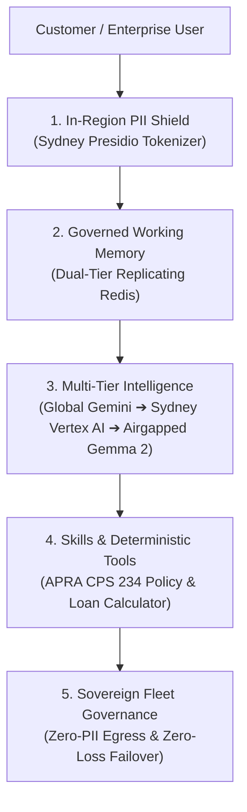

# Project Sovereign-Stream (Agent Robot)
### The Resilient, Sovereign Enterprise AI Agent: An Interactive Educational Demo

[](https://github.com/google/agent-development-kit)
[](https://cloud.google.com/vertex-ai)
[-10b981)](https://ai.google.dev/gemma)
[](https://microsoft.github.io/presidio/)
[](https://redis.io)
[](https://www.oaic.gov.au/privacy/australian-privacy-principles)

---

## 1. Executive Summary: Demystifying AI Agents

When enterprise leaders evaluate AI agents, they typically encounter two extremes:
1. **Cloud-Tethered Agents:** Powerful frontier reasoning, but vulnerable to international network outages, undersea cable severances, and regulatory bans against sending customer Personally Identifiable Information (PII) offshore.
2. **Disconnected On-Prem Silos:** Completely sovereign, but cumbersome to build, expensive to maintain, and lacking the reasoning flexibility of frontier models.

**Project Sovereign-Stream (Agent Robot)** is an **interactive educational demonstration** developed for enterprise CIOs, CISOs, and technical architects. It transforms abstract agent concepts into a living, tactile experience, demonstrating:
- How modern AI agents think (**Intelligence**), remember (**Memory**), protect data (**PII & Privacy**), act (**Skills & Tools**), and scale (**Tokenomics**).
- How an enterprise agent built on **100% Google ADK and Vertex AI** operates continuously across global, regional, and airgapped environments without losing a single turn of conversation context.



---

## 2. The 5-Stage Educational Learning Journey

Rather than presenting an opaque chatbot, this demo unpacks an agent before your eyes across **5 progressive stages**. Each stage activates a distinct architectural capability in the robot character's chassis, teaching a foundational concept in agent system design:

```
+---------------------------------------------------------------------------------------------------------+
|                                    DYNAMIC ROBOT CHARACTER ANATOMY                                      |
|                                                                                                         |
|                                      +-------------------------------+                                  |
|                                      |      [ GLASS DOME VISOR ]     |                                  |
|                                      | 🧠 Synaptic Brain Luminescence |                                  |
|                                      |    🔵 Global Gemini (Tier 1)  |                                  |
|                                      |    🟠 Sydney Vertex (Tier 2)  |                                  |
|                                      |    🟢 Airgap Gemma (Tier 3)   |                                  |
|                                      +-------------------------------+                                  |
|                                                     ||                                                  |
|                   +---------------+      +----------------------+      +---------------+                |
|     (Left Arm)    | 🦾 SHOULDER   |      |     ROBOT TORSO      |      | 🦾 SHOULDER   |   (Right Arm)  |
|                   | • Upper Piston|------|   [Agent Chassis]    |------| • Upper Piston|                |
|                   | • Forearm     |      | • Stage 0: Runtime   |      | • Forearm     |                |
|                   | • Energy Rib  |      | • Stage 0: Model Loc |      | • Energy Rib  |                |
|                   |               |      | • Stage 0: Model Tier|      |               |                |
|                   | Articulates & |      | • Stage 1: Memory    |      | Articulates & |                |
|                   | Scales Height |      | • Stage 2: PII Shield|      | Scales Height |                |
|                   | Dynamically   |      | • Stage 3: Skills    |      | Dynamically   |                |
|                   +---------------+      | • Stage 3: Tools     |      +---------------+                |
|                                          | • Stage 3: Storage   |                                       |
|                                          | • Stage 4: Tokenomics|                                       |
|                                          +----------------------+                                       |
|                                                     ||                                                  |
|                                          +----------------------+                                       |
|                                          | 🦵 HYDRAULIC LEGS    |                                       |
|                                          | (Compresses Stance)  |                                       |
|                                          +----------------------+                                       |
+---------------------------------------------------------------------------------------------------------+
```

---

### **Stage 0: Genesis Lab — Powering Up the Agent**
> **Demo Action:** The interactive Industrial Power-Up Lab presents two physical circuit breakers. Flipping **Breaker #1** powers the execution chassis (triggering optic bootup strobes and injecting `⚙️ Runtime`). Flipping **Breaker #2** ignites the glowing neural brain in the glass dome and injects `📍 Model Location` and `⚡ Model Tier`.

#### **What Customers Learn:**
1. **An LLM is Not an Agent:** An LLM is a stateless next-token predictor. An **agent** is an execution runtime that wraps the model in a continuous loop, managing memory, invoking tools, and evaluating policies.
2. **Data Residency at Inception:** Where the model runs dictates legal jurisdiction. Enterprises can establish boundaries at initialization:
   - **Global Hyperscaler:** Maximum parameter scale and speed.
   - **Regional In-Country Cloud:** Sovereign compliance pinned to Sydney (`australia-southeast1`).
   - **Local Airgapped Enclave:** Self-hosted open-weights on private hardware.

---

### **Stage 1: Resilience & Cascades — The Memory & Survivability Layer**
> **Demo Action:** The robot chassis expands to incorporate `💾 Memory` (backed by the dual-tier replicating session store). Users chat with the agent, then flip the **Chaos Monkey** breaker to simulate a severe cloud network severance or geopolitical lockout.

#### **What Customers Learn:**
1. **Why Working Memory Matters:** Agents require state to execute multi-step plans, maintain user personas, and remember tool outputs. Without stateful memory, an agent resets to zero on every turn.
2. **Surviving Cloud Outages with Zero Context Loss:** When cloud connectivity drops, conventional chatbots fail with HTTP 500 errors and lose everything. In Sovereign-Stream, the **Dual-Tier Replicating Redis/Valkey Session Store** continuously streams conversation turns to an airgapped replica.
3. **The 3-Tier Failover Cascade:**
   ```mermaid
   graph LR
       T1["Tier 1: Global Cloud<br/>(Gemini 2.5/3.7 Pro)"] -->|"Latency / Quota / Embargo"| T2["Tier 2: Sydney Vertex AI<br/>(Regional Gemini)"]
       T2 -->|"Cloud Severance / Airgap"| T3["Tier 3: Airgapped Enclave<br/>(Local Gemma 2 2B)"]
       T3 -.->|"Autonomous Recovery Probe"| T1
   ```
   - When severed, the agent instantly demotes to **Tier 3 (Local Gemma 2)**.
   - The robot's dome luminescence shifts from **Sapphire Blue** to **Sovereign Emerald**.
   - **Crucial Result:** The agent answers follow-up questions referencing facts stated three turns earlier. Zero lost turns, zero restarts.
4. **Autonomous Self-Healing:** The background **Recovery Sentinel** continuously probes upstream health. When cloud connectivity returns, the agent promotes back to Tier 1 without administrative overhead.

---

### **Stage 2: Zero-PII Shield — Privacy & In-Region Sovereignty**
> **Demo Action:** The robot chassis injects the `🛡️ PII Cleanser` module. The **Dual-Lens Wire Inspector** HUD activates, displaying side-by-side what the user sees versus what crosses the network wire.

#### **What Customers Learn:**
1. **Australian Privacy Principle 8 (APP 8 Compliance):** APP 8 regulates cross-border disclosures. Regulated entities (banks, healthcare, government) face massive penalties if raw customer identifiers, tax file numbers, or vehicle registrations cross international borders.
2. **Surrogate Tokenization Over the Wire:**
   - User inputs: *"Assess customer Jane Citizen, license plate NSW-ABC12D, phone 0412 345 678."*
   - In-region Presidio analyzer in Sydney detects Australian entities (`AULicensePlateRecognizer`, AU phone, TFN, names).
   - The outbound payload replaces real data with cryptographic surrogates:
     ```json
     {
       "prompt": "Assess customer <PII_PERSON_1>, license plate <PII_AU_LICENSE_PLATE_1>, phone <PII_PHONE_NUMBER_1>."
     }
     ```
3. **Dual-Lens Verification:** Customers observe with their own eyes that the cloud model only ever processes anonymous surrogate tokens. When the model returns a response, the in-region gateway de-tokenizes the payload locally before rendering cleartext in the UI.

---

### **Stage 3: Enterprise Sovereignty — Skills, Grounding & Deterministic Tools**
> **Demo Action:** The robot torso mounts `🧠 Skill` (APRA CPS 234 Underwriter rulebook), `🔧 Tool` (Deterministic Loan LVR Calculator), and `📁 Storage` (Encrypted at Rest).

#### **What Customers Learn:**
1. **Deterministic Execution vs. Probabilistic Hallucination:** Large language models should reason over intent, but they must **never** perform financial math or compliance checks probabilistically. Agents use tools to execute deterministic, auditable code.
2. **Enterprise RAG Context Grounding:** When retrieving credit records or policy documents from Google Drive or Google Sheets (Trix), the `SovereignGroundingInterceptor` scrubs sensitive entities in-region *before* context injection into the prompt.
3. **Airgapped Enclave Execution:** In Tier 3 crisis mode, the agent cannot reach external SaaS tools. Sovereign-Stream demonstrates **baked enclave skills**: the loan-to-value ratio (LVR) calculator and APRA lending guidelines execute locally inside the private enclave with full cryptographic provenance logs.

---

### **Stage 4: Tokenomics & Cost — Enterprise Fleet Governance**
> **Demo Action:** The robot chassis activates `📊 Tokens (In/Out)`, `🏷️ Model Cost (/1M)`, and `💰 Cost / x10k Turns`, rendering live economic telemetry on every message.

#### **What Customers Learn:**
1. **The Economics of Multi-Tier Routing:** Routing 100% of enterprise workloads to giant frontier models creates unsustainable API bills.
2. **Intelligent Cost Optimization:**
   - High-complexity reasoning and open-ended synthesis route to **Gemini 2.5/3.7 Pro**.
   - Standard conversational turns and high-volume classification route to **Gemini Flash**.
   - Routine data verification, local compliance rules, and airgapped turns run on **Gemma 2** at **zero marginal API cost**.
3. **Predictable Fleet Budgeting:** By analyzing token consumption in real time and projecting costs across 10,000 turns, platform engineering teams can accurately forecast AI budgets before enterprise-wide rollouts.

---

## 3. Technical Architecture Matrix

| Architectural Dimension | Tier 1: Global Cloud | Tier 2: Regional Cloud | Tier 3: Airgapped Enclave |
| :--- | :--- | :--- | :--- |
| **Model Engine** | Gemini 2.5 / 3.7 Pro & Flash | Vertex AI Gemini (Regional) | Open-Weights Gemma 2 (2B / 9B) |
| **Compute Physical Location** | Global Hyperscaler | Sydney (`australia-southeast1`) | Private Isolated VPC / On-Prem |
| **Network Dependency** | Public Internet | Australian Cloud VPC | **Zero (Completely Airgapped)** |
| **PII Transit Status** | **Surrogate Tokens Only** | **Surrogate Tokens Only** | **In-Enclave / Local Only** |
| **Regulatory Compliance** | APP 8 Compliant | APP 8 & APRA CPS 234 Compliant | ISM Protected / Full Airgap |
| **Session Memory Store** | Active Redis (Sydney) | Active Redis (Sydney) | Local Standby Redis Replica |
| **Dome Luminescence** | 🔵 Sapphire Blue | 🟠 Amber Gold | 🟢 Sovereign Emerald |

---

## 4. Quickstart: Launching the Demo

### Prerequisites
- Python 3.11+
- Google Cloud Project with Vertex AI enabled (`australia-southeast1`)
- Google Cloud SDK (`gcloud`) authenticated

### 1. Launch the Complete Multi-Tier Stack
Clone the repository and run the automated startup script:

```bash
git clone https://github.com/mattpancino/agentrobot.git
cd agentrobot
./scripts/start_mvp.sh
```

*(To run the live Tier 3 demo with automated IAP tunneling to the GCE Gemma 2 enclave VM in Sydney)*:
```bash
./scripts/start_live_gemma_demo.sh
```

### 2. Access the Interactive UI
Open your browser to the local or cloudtop gateway:
- **Cloudtop Workstation:** `http://elevateinstance.c.googlers.com:8088`
- **Local Workstation:** `http://localhost:8088`

---

## 5. Recommended 5-Minute Customer Walkthrough Script

| Step | Action in Demo UI | Talking Point for Customer |
| :---: | :--- | :--- |
| **1** | Start on **Stage 0**. Flip Breaker #1, then Breaker #2. | *"Notice how the agent boots up. An agent isn't just an API key; it's a runtime harness linked to a model."* |
| **2** | Advance to **Stage 1**. Ask: *"Hi, I'm reviewing loan options for Sarah Connor in Sydney."* | *"Notice the blue dome (Global Gemini) and the memory row tracking our conversation state."* |
| **3** | Flip the **Chaos Monkey** breaker to simulate a severed cloud link. Ask: *"What was the customer's name and city?"* | *"The dome turned emerald. The cloud was cut, but the agent answered using local Gemma 2 with zero lost context."* |
| **4** | Advance to **Stage 2**. Enter: *"Vehicle registration is NSW-XYZ888, phone 0411222333."* Open **Dual-Lens View**. | *"Notice the customer sees cleartext, but the wire shows `<PII_AU_LICENSE_PLATE_1>`. Zero raw PII left Australia."* |
| **5** | Advance to **Stage 3 & 4**. Request an APRA loan assessment. Review tool output and tokenomics. | *"The agent used deterministic code for the LVR math, and we have complete visibility into cost per 10k turns."* |

---

## 6. Developer Extension: Building Your Own Sovereign Agent

All specialist subagents inherit full in-region PII tokenization, grounding interceptors, and 3-tier failover in **under 5 lines of code** by subclassing `SovereignResilientAgent`:

```python
from src.adk.base_agent import SovereignResilientAgent

class MortgageUnderwritingAgent(SovereignResilientAgent):
    """Enterprise mortgage assessment agent inheriting 100% sovereign governance."""
    system_prompt = "You are a senior mortgage underwriter compliant with APRA CPS 234."

    def register_tools(self):
        return [self.calculate_customer_lvr_and_serviceability]
```

---

## 7. License & Authorship

- **Author:** Matthew Pancino (`mattpancino@google.com`)
- **Repository:** [https://github.com/mattpancino/agentrobot](https://github.com/mattpancino/agentrobot)
- **Framework:** Google Agent Development Kit (ADK) & Vertex AI Reasoning Engine
- **License:** Apache 2.0
