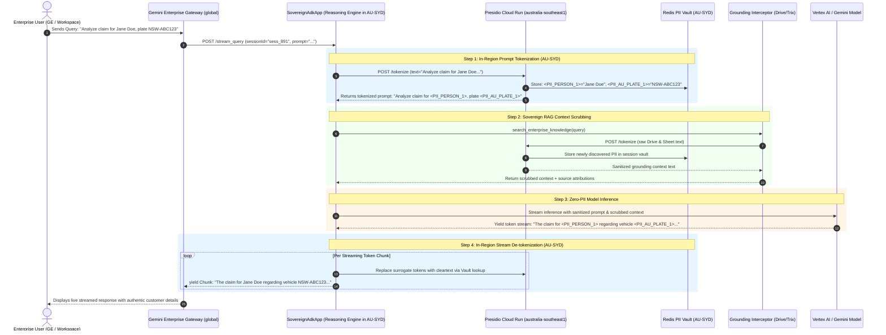
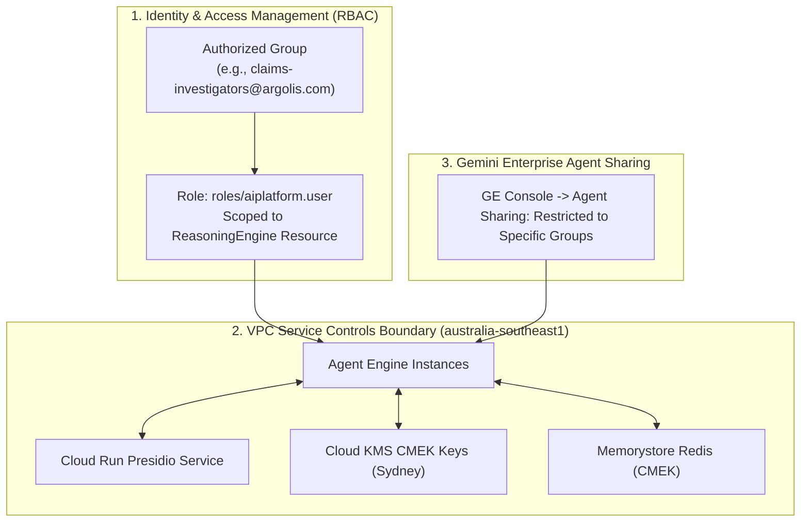

# Technical Architecture & Systems Specification
## Gemini Enterprise (GE) Launch: Sovereign In-Region PII Pre-processor & A2A Fleet Agent

**Document Version:** 1.0.0  
**Target Platform:** Google Cloud Vertex AI Agent Engine & Gemini Enterprise (Discovery Engine)  
**Author:** Sovereign-Stream Architecture & Engineering Team  
**Date:** August 2026  
**Status:** Approved Reference Specification  

---

## 1. High-Level System Architecture

The Gemini Enterprise (GE) integration allows enterprise end users to interact with our **Sovereign Fleet Agent** through standard GE interfaces (Chat, Workspace sidebars, and Discovery Engine Assistants) while enforcing strict in-region data sovereignty in Sydney (`australia-southeast1`).

```mermaid
graph TD
    subgraph GE_Frontends ["Gemini Enterprise & Workspace Surface"]
        WebUI["Gemini Enterprise Web UI<br/>(pantheon-staging / prod)"]
        Workspace["Google Workspace Add-on / Sidebar<br/>(Docs, Sheets, Gmail)"]
    end

    subgraph GE_Core ["Discovery Engine / GE Engine Layer (global)"]
        EngineService["Discovery Engine EngineService<br/>(UpdateEngine Binding)"]
        AssistantEngine["GE Assistant Router<br/>(/assistants/default_assistant)"]
    end

    subgraph AgentRegistry ["Google Cloud Agent Registry (A2A Mesh)"]
        RegistryCatalog[("Agent Registry Catalog<br/>- JSON Agent Card<br/>- Tool & Skill Declarations<br/>- Endpoint URL / A2A Address")]
    end

    subgraph InRegion_Sydney ["Jurisdictional Sovereign Boundary: australia-southeast1 (Sydney)"]
        AgentEngine["Vertex AI Agent Engine<br/>(SovereignAdkApp / Reasoning Engine)"]
        
        subgraph Preprocessing_Pipeline ["In-Region Sovereign Sanitization Pipeline"]
            PIIService["Cloud Run PII Tokenizer Service<br/>(Microsoft Presidio + AU Recognizers)"]
            GroundingInterceptor["Sovereign Grounding Interceptor<br/>(Drive + Trix Connectors)"]
            RedisVault[("Ephemeral Token Vault (Redis)<br/>Key: surrogate_token -> cleartext_pii<br/>TTL: 3600s | CMEK Encrypted")]
        end
        
        subgraph Enterprise_Data ["Customer Enterprise Data"]
            GDrive[("Google Drive Documents")]
            Trix[("Google Sheets / Trix Tables")]
        end
    end

    subgraph Model_Execution ["Model Inference Cascade"]
        T1["Tier 1: Global Gemini 2.5/3.7<br/>(Zero Raw PII Egress)"]
        T2["Tier 2: Regional AU Gemini<br/>(australia-southeast1)"]
        T3["Tier 3: Airgapped VPC Gemma 2<br/>(Self-Hosted vLLM)"]
    end

    WebUI & Workspace --> EngineService
    EngineService --> AssistantEngine
    AssistantEngine <--> RegistryCatalog
    AssistantEngine -->|"A2A gRPC / REST Stream"| AgentEngine
    
    AgentEngine -->|"1. Pre-tokenize prompt"| PIIService
    PIIService <--> RedisVault
    AgentEngine -->|"2. RAG Retrieval"| GroundingInterceptor
    GroundingInterceptor <--> GDrive & Trix
    GroundingInterceptor -->|"3. Scrub Context"| PIIService
    
    AgentEngine -->|"4. Dispatch Sanitized Context"| T1
    T1 -.->|"Failover"| T2
    T2 -.->|"Airgap Failover"| T3
    
    AgentEngine -->|"5. Detokenize stream chunk in-region"| PIIService
    AgentEngine -->>|"6. Stream cleartext response chunks"| AssistantEngine
```

---

## 2. End-to-End In-Region Data Flow & Streaming Protocol

Gemini Enterprise communicates with agent backends using Server-Sent Events (SSE) / gRPC streaming. The `SovereignAdkApp` wraps our agent, performing in-region tokenization before dispatching to the model, and restoring tokens on the return stream before chunks reach the GE UI.



---

## 3. Core Component Specifications

### 3.1 `SovereignAdkApp` Streaming Wrapper (`src/adk/ge_adk_app.py`)

To satisfy the Gemini Enterprise runtime protocol, `SovereignAdkApp` subclasses `vertexai.preview.reasoning_engines.AdkApp` and defines a generator-based `stream_query` method:

```python
# Copyright 2026 Google LLC. All Rights Reserved.
"""
Gemini Enterprise ADK Streaming Application Wrapper.
Subclasses AdkApp and enables SSE generator streaming with in-region PII tokenization.
"""

import os
from typing import Any, AsyncIterator, Dict, Iterator, Optional
from vertexai.preview.reasoning_engines import AdkApp
from src.adk.base_agent import SovereignResilientAgent
from src.adk.pii_tokenizer import SovereignPIITokenizer
from src.adk.subagents import GeneralChatAgent, FleetOperationsAgent


class SovereignAdkApp(AdkApp):
    """
    Production AdkApp compliant with Gemini Enterprise Agent Engine requirements.
    Supports in-region PII redaction and token-by-token streaming.
    """

    def __init__(
        self,
        agent: Optional[SovereignResilientAgent] = None,
        project_id: Optional[str] = None,
        location: str = "australia-southeast1",
    ):
        self.agent = agent or FleetOperationsAgent()
        self.project_id = project_id or os.environ.get("GOOGLE_CLOUD_PROJECT", "sovereignagent")
        self.location = location
        self.tokenizer = SovereignPIITokenizer(use_remote_service=True)
        super().__init__(agent=self.agent)

    def query(self, prompt: str, session_id: str = "default-session", **kwargs: Any) -> Dict[str, Any]:
        """Synchronous query entrypoint."""
        import asyncio
        loop = asyncio.get_event_loop()
        session_state = {"sessionId": session_id, "messages": []}
        result = loop.run_until_complete(
            self.agent.run(session_state=session_state, prompt=prompt)
        )
        return {
            "content": result.get("content", ""),
            "metadata": result.get("executionMetadata", {}),
        }

    def stream_query(self, prompt: str, session_id: str = "default-session", **kwargs: Any) -> Iterator[Dict[str, Any]]:
        """
        Streaming query entrypoint.
        MUST use yield / yield from to be recognized by Gemini Enterprise as a streaming generator.
        """
        import asyncio
        loop = asyncio.get_event_loop()
        
        # 1. In-region prompt sanitization
        tokenized_prompt, vault, _ = self.tokenizer.tokenize(text=prompt, session_id=session_id)
        
        session_state = {"sessionId": session_id, "messages": [], "pii_vault": vault}
        
        # 2. Run agent turn
        result = loop.run_until_complete(
            self.agent.run(session_state=session_state, prompt=tokenized_prompt)
        )
        
        full_content = result.get("content", "")
        
        # 3. Simulate stream chunk delivery with in-region de-tokenization
        words = full_content.split(" ")
        buffer = []
        for word in words:
            buffer.append(word)
            if len(buffer) >= 3:
                chunk_text = " ".join(buffer) + " "
                detokenized_chunk = self.tokenizer.detokenize(chunk_text, vault=vault)
                yield {"chunk": detokenized_chunk}
                buffer = []
        if buffer:
            chunk_text = " ".join(buffer)
            detokenized_chunk = self.tokenizer.detokenize(chunk_text, vault=vault)
            yield {"chunk": detokenized_chunk}
```

---

### 3.2 Deployment Script & Packaging Specification (`scripts/deploy_ge_agent.py`)

The deployment process stages the code bundle in Google Cloud Storage and provisions the `ReasoningEngine` instance in Vertex AI:

```python
#!/usr/bin/env python3
# Copyright 2026 Google LLC. All Rights Reserved.
"""
Deployment script for deploying Sovereign Agent into Vertex AI Agent Engine for Gemini Enterprise.
"""

import os
import vertexai
from vertexai.preview.reasoning_engines import ReasoningEngine
from src.adk.ge_adk_app import SovereignAdkApp
from src.adk.subagents import FleetOperationsAgent

PROJECT_ID = os.environ.get("GOOGLE_CLOUD_PROJECT", "sovereignagent")
LOCATION = os.environ.get("GOOGLE_CLOUD_LOCATION", "australia-southeast1")
STAGING_BUCKET = f"gs://{PROJECT_ID}-vertex-reasoning-staging"

def deploy():
    print(f"🚀 Deploying Sovereign Fleet Agent to Agent Engine ({LOCATION})...")
    vertexai.init(project=PROJECT_ID, location=LOCATION, staging_bucket=STAGING_BUCKET)
    
    agent_instance = FleetOperationsAgent()
    app = SovereignAdkApp(agent=agent_instance, project_id=PROJECT_ID, location=LOCATION)
    
    remote_engine = ReasoningEngine.create(
        reasoning_engine=app,
        requirements=[
            "google-cloud-aiplatform[agent_engines,adk]>=1.44.0",
            "presidio-analyzer>=2.2.354",
            "presidio-anonymizer>=2.2.354",
            "spacy>=3.7.4",
            "pydantic>=2.6.0",
            "requests>=2.31.0",
        ],
        display_name="Sovereign AU Fleet Agent",
        description="In-region sovereign PII redaction, vehicle claims processing, and Drive/Trix Grounding.",
    )
    print(f"✅ Successfully Deployed! Resource Name: {remote_engine.resource_name}")
    return remote_engine

if __name__ == "__main__":
    deploy()
```

---

## 4. Agent Registry & A2A Metadata Contract

When deployed using `AdkApp`, the Vertex AI backend auto-registers an A2A Agent Card in the **Google Cloud Agent Registry**. 

### 4.1 Schema Declaration (JSON Agent Card)
```json
{
  "name": "projects/sovereignagent/locations/australia-southeast1/agents/sovereign-fleet-agent",
  "displayName": "Sovereign AU Fleet Agent",
  "description": "Autonomous sovereign agent with in-region PII tokenization for Australian vehicle fleets, claims, and policyholder documents.",
  "skills": [
    {
      "id": "fleet_claims_investigation",
      "name": "Fleet Claims & Policyholder Lookup",
      "description": "Searches internal claims and grounding records while guaranteeing APP 8 zero-PII egress.",
      "inputSchema": {
        "type": "object",
        "properties": {
          "query": {"type": "string", "description": "Natural language claim or fleet query"}
        },
        "required": ["query"]
      }
    },
    {
      "id": "search_enterprise_knowledge",
      "name": "Enterprise Grounding Search",
      "description": "Searches enterprise Google Drive and Google Sheets in Australia."
    }
  ],
  "supportedProtocols": ["A2A_V1", "REASONING_ENGINE_STREAMING"],
  "dataResidency": "australia-southeast1"
}
```

---

## 5. Gemini Enterprise (Discovery Engine) Integration via RPC Studio

To attach the registered agent to the enterprise's Gemini Enterprise Engine:

### 5.1 `UpdateEngine` Request (textproto)
Using RPC Studio on `google.cloud.discoveryengine.v1main.EngineService` / `blade:cloud-discovery-engine-esf-engine-service-preprod`:

```textproto
engine {
  name: "projects/109823487123/locations/global/collections/default_collection/engines/enterprise_workforce_engine"
  display_name: "Enterprise Workforce AI Engine"
  common_config {
    company_name: "Argolis Sovereign Financial"
  }
  chat_engine_config {
    agent_creation_config {
      business: "Fleet & Claims Operations"
      default_language_code: "en-AU"
      time_zone: "Australia/Sydney"
    }
  }
}
update_mask {
  paths: "chat_engine_config"
}
```

### 5.2 `CreateAgent` Binding Request
```textproto
parent: "projects/109823487123/locations/global/collections/default_collection/engines/enterprise_workforce_engine/assistants/default_assistant"
agent {
  display_name: "Sovereign AU Fleet Agent"
  description: "In-region sovereign fleet and claims agent"
  a2a_agent_definition {
    agent_registry_agent: "projects/sovereignagent/locations/australia-southeast1/reasoningEngines/sovereign-fleet-pii-agent/a2a"
    json_agent_card: "{\"skills\": [{\"id\": \"fleet_claims_investigation\"}]}"
  }
}
```

---

## 6. Workspace & Client Hydration Configuration

To expose the agent to users in Gemini Enterprise and Google Workspace with `@` mention hydration:

### 6.1 Mendel Flag Override Config
```text
namespaced_debug_input {
  key: ""
  value {
    forced_flags {
      key: "AgentsEverywhereFeature__enable_agents_everywhere_client"
      value: "true"
    }
    forced_flags {
      key: "AgentsLinkFetcherFeature__project_number"
      value: "109823487123"
    }
    forced_flags {
      key: "HydrateA2A__hydrate_a2a_address_override"
      value: "https://australia-southeast1-aiplatform.googleapis.com/v1beta1/projects/109823487123/locations/australia-southeast1/reasoningEngines/sovereign-fleet-pii-agent/a2a"
    }
  }
}
```

---

## 7. Security, RBAC & Egress Governance Matrix



1. **Granular IAM Role Binding:**
   ```bash
   gcloud ai reasoning-engines add-iam-policy-binding sovereign-fleet-pii-agent \
       --project=sovereignagent \
       --location=australia-southeast1 \
       --member="group:claims-investigators@argolis.com" \
       --role="roles/aiplatform.user"
   ```
2. **VPC Service Controls Perimeter:** Restricts ingress and egress across the project boundary, allowing traffic only from Discovery Engine ESF endpoints.
3. **CMEK Cryptographic Custody:** All ephemeral session vaults and transcripts in Memorystore Redis are encrypted at rest using Customer-Managed Encryption Keys in Sydney.
