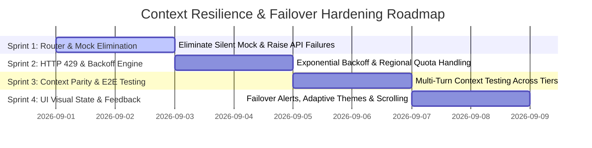

# Implementation Plan: Multi-Tier Context Resilience & Rate-Limit Hardening

**Document Version:** 1.0.0  
**Target Branch:** `feature/stage-zero-demo`  
**Execution Methodology:** Sprint-Based Phased Rollout (4 Sprints)  
**Author:** Sovereign-Stream Architecture & Engineering Team  
**Date:** September 2026  
**Status:** Approved for Implementation  

---

## 1. Executive Summary

This plan outlines the 4-sprint roadmap to ensure that conversational memory in Project Sovereign-Stream is **strictly managed by the LLM context window at all times**, eliminate silent offline mock fallbacks in live inference, gracefully handle regional `429 RESOURCE_EXHAUSTED` rate limits via exponential backoff, and provide crisp visual failover feedback in the operator UI.

---

## 2. Sprint Breakdown & Actionable Deliverables

### Sprint 1: Cascade Router Hardening & Mock Fallback Quarantine
**Primary Goal:** Ensure live inference failures are never masked by synthetic mock responses and guarantee clean cascading to subsequent tiers.

* **Key Tasks:**
  1. Modify `_invoke_gemini` in [`src/adk/cascade_router.py`](file:///usr/local/google/home/mattpancino/dev/sovereignagent/src/adk/cascade_router.py):
     - Remove silent `generate_command_response` fallback for live runs.
     - Isolate `generate_command_response` exclusively to hermetic unit test environments (`os.environ.get("PYTEST_CURRENT_TEST")`).
  2. Update `_call_vertex_ai_model` in [`src/adk/cascade_router.py`](file:///usr/local/google/home/mattpancino/dev/sovereignagent/src/adk/cascade_router.py):
     - Remove `except Exception: pass` that returns `None`.
     - Propagate non-200 HTTP responses (e.g. `429 RESOURCE_EXHAUSTED`, `503 Service Unavailable`) as typed exceptions (`VertexAIQuotaExhaustedError`, `VertexAIEndpointError`).
  3. Ensure `execute_turn` cascade loop logs Hop failure with exact status code and demotes cleanly:
     - Hop 1 (Tier 1 Global) fails $\rightarrow$ Hop 2 (Tier 2 Regional AU-SYD).
     - Hop 2 (Tier 2 Regional) fails $\rightarrow$ Hop 3 (Tier 3 Sovereign Enclave Gemma).
* **Deliverables:**
  - ✅ Unit tests verifying that API errors on Tier 1 and Tier 2 successfully reach Tier 3.
  - ✅ Complete elimination of unexpected mock responses in live sessions.

---

### Sprint 2: HTTP 429 Mitigation & Exponential Backoff Engine
**Primary Goal:** Absorb transient rate limits on regional endpoints (`australia-southeast1`) before forcing cross-tier demotion.

* **Key Tasks:**
  1. Implement async retry helper with exponential backoff and full jitter:
     - Catch HTTP `429` and `503`.
     - Up to 2 retries: wait $500\text{ms} \pm 100\text{ms}$ on attempt 1, $1500\text{ms} \pm 200\text{ms}$ on attempt 2.
  2. Implement Regional Model Resiliency:
     - If `gemini-2.5-flash` in `australia-southeast1` reports unallocated quota (0 QPM), gracefully attempt fallback to provisioned regional model (e.g. `gemini-1.5-flash-002` or `gemini-1.5-pro-002`) prior to failing over to Tier 3.
  3. Populate rich Hop Telemetry:
     - Record `retriesAttempted`, `rateLimitEncountered: true`, and `backoffDurationMs` in `FailoverHopLog`.
* **Deliverables:**
  - ✅ Backoff retry mechanism in `cascade_router.py`.
  - ✅ Resilient regional model negotiation.
  - ✅ Hop telemetry reporting retry counts.

---

### Sprint 3: Context Window Integrity & Cross-Tier Memory Parity
**Primary Goal:** Verify that conversational context (`session_state["messages"]`) is identically preserved and understood whether answered by Tier 1, Tier 2, or Tier 3.

* **Key Tasks:**
  1. Validate canonical context formatting:
     - Vertex AI: `contents = [{"role": "user"|"model", "parts": [{"text": msg}]}]`
     - Sovereign Gemma: `messages = [{"role": "user"|"assistant"|"system", "content": msg}]`
  2. Redis Dual-Replica State Synchronization:
     - Verify `ReplicatingSessionService` writes identical context state to Redis DB 0 (Primary) and DB 1 (Standby).
  3. Write Multi-Turn Failover Integration Test Suite (`tests/test_context_failover_parity.py`):
     - Turn 1: "Name five dog breeds" $\rightarrow$ Tier 1 Global (Max, Bella, Charlie, Lucy, Buddy).
     - Fault Injection: Fail Tier 1.
     - Turn 2: "What was the first dog name?" $\rightarrow$ Route to Tier 2/Tier 3 $\rightarrow$ Assert LLM output contains "Max".
* **Deliverables:**
  - ✅ Automated regression test proving context window continuity across failover boundaries.
  - ✅ End-to-end multi-turn verification across Gemini and Gemma.

---

### Sprint 4: UI Visual Feedback & Telemetry Clarity
**Primary Goal:** Give the operator unmistakable visual cues when failover occurs and prevent telemetry clipping.

* **Key Tasks:**
  1. Add Failover Alert Banner in [`ChatWindow.tsx`](file:///usr/local/google/home/mattpancino/dev/sovereignagent/src/frontend/src/components/ChatWindow.tsx):
     - When `metadata.failoverOccurred === true`, render an alert pill above the assistant response:
       `⚠️ Failover Active: Tier 1 Global Failed -> Demoted to Tier 2 Regional (AU-SYD)`
  2. Add Tier-Adaptive Bubble Styling:
     - Tier 1: Dark Slate with subtle Blue border (`border-blue-500/30`).
     - Tier 2: Dark Slate with vibrant Amber border (`border-amber-500/50`).
     - Tier 3: Dark Slate with Emerald border (`border-emerald-500/50`).
  3. Auto-Scroll on Completion:
     - Ensure `ChatWindow` scrolls to bottom when streaming/rendering completes so the tier badge and telemetry are never pushed off-screen.
  4. Real-Time Sidebar Stance Update:
     - Visually flag pending failover in `ChaosPanel` as soon as the "Fail" box is toggled.
* **Deliverables:**
  - ✅ Prominent visual failover alert banners in chat.
  - ✅ Tier-adaptive message bubble border styling.
  - ✅ Auto-scrolling to keep telemetry footers visible.
