# Technical Specification: Multi-Tier Context Window & Failover Resilience

**Document Version:** 1.0.0  
**Target Platform:** Project Sovereign-Stream (Google ADK & Vertex AI)  
**Author:** Sovereign-Stream Architecture & Engineering Team  
**Date:** September 2026  
**Status:** Approved Reference Specification  

---

## 1. Executive Summary & Objective

In Project Sovereign-Stream, conversational memory is **strictly an emergent property of the LLM context window**, maintained across turns and seamlessly transferred across all three resilience tiers:
* **Tier 1 (Global Vertex AI):** Global Gemini 3.7 / 2.5 Flash endpoints.
* **Tier 2 (Regional Vertex AI):** In-country data residency in Sydney (`australia-southeast1`).
* **Tier 3 (On-Premises Sovereign Enclave):** Airgapped VPC running self-hosted open-weights models (`google/gemma-2-2b-it`) via private IAP tunnel on `localhost:8001`.

This specification formalizes the elimination of synthetic mock fallbacks during live operations, specifies exponential backoff and jitter for handling transient HTTP `429 RESOURCE_EXHAUSTED` errors in regional endpoints, and defines UI visual feedback mechanisms for clear operator visibility.

---

## 2. End-to-End Context Window Architecture

```mermaid
sequenceDiagram
    autonumber
    actor User as User / Client
    participant Web as FastAPI Backend & UI
    participant Session as ReplicatingSessionService (Redis DB 0 & 1)
    participant Router as SovereignCascadeRouter
    participant T1 as Tier 1: Global Vertex AI
    participant T2 as Tier 2: Regional AU-SYD
    participant T3 as Tier 3: Sovereign Enclave (Gemma 2)

    User->>Web: POST /api/chat (Prompt + SessionID)
    Web->>Session: get_session(session_id)
    Session-->>Web: session_state (messages history)
    Web->>Router: execute_turn(session_state, prompt, messages)
    
    rect rgb(30, 41, 59)
        note over Router, T1: Attempt Hop 1 (Tier 1 Global)
        Router->>T1: POST :generateContent (Full Context Window)
        alt Tier 1 Healthy
            T1-->>Router: 200 OK (Response Content)
        else Tier 1 Fault Injected / Unavailable
            T1--xRouter: 404 / Connection Error
            note over Router: Hop 1 FAILED -> Initiate Hop 2
        end
    end

    rect rgb(45, 35, 20)
        note over Router, T2: Attempt Hop 2 (Tier 2 Regional AU-SYD)
        Router->>T2: POST :generateContent (Full Context Window)
        alt Tier 2 Rate-Limited (HTTP 429)
            note over Router: Backoff & Retry (500ms -> 1500ms)
            Router->>T2: Retry POST :generateContent
            T2--xRouter: 429 RESOURCE_EXHAUSTED
            note over Router: Hop 2 FAILED -> Initiate Hop 3
        end
    end

    rect rgb(20, 45, 35)
        note over Router, T3: Attempt Hop 3 (Tier 3 Sovereign Enclave)
        Router->>T3: POST /v1/chat/completions (Normalized Context Window)
        T3-->>Router: 200 OK (Gemma Inference with Full Memory)
    end

    Router-->>Web: Response Content + Failover Hop Telemetry
    Web->>Session: save_session (Append User & Model Turns)
    Web-->>User: HTTP 200 (Content, Active Tier, Hop Telemetry)
```



---

## 3. Session State & Context Window Lifecycle

### 3.1 Session Persistence (`ReplicatingSessionService`)
* All conversational turns are stored in canonical order within `session_state["messages"]`:
  ```json
  [
    {"role": "user", "content": "Give me the names of five dogs and their breeds."},
    {"role": "model", "content": "1. Max (Labrador Retriever)\n2. Bella (German Shepherd)..."},
    {"role": "user", "content": "what was the first dog name"}
  ]
  ```
* Every mutation is replicated across:
  * **Primary Store:** Redis DB 0 (In-Region Tier 2 persistence).
  * **Standby Store:** Redis DB 1 (Sovereign Enclave Tier 3 standby persistence).

### 3.2 Tier-Specific Context Formatting
On every inference turn, the entire chronological history plus the incoming user prompt is packaged into the tier's native context window:

1. **Vertex AI Gemini (Tier 1 & Tier 2):**
   ```python
   formatted_contents = []
   for msg in messages:
       role = "user" if msg.get("role") == "user" else "model"
       clean_text = strip_sovereign_header(msg.get("content", ""))
       if clean_text:
           formatted_contents.append({"role": role, "parts": [{"text": clean_text}]})
   formatted_contents.append({"role": "user", "parts": [{"text": prompt}]})
   payload = {"contents": formatted_contents}
   ```

2. **Sovereign Enclave Gemma 2 (Tier 3):**
   ```python
   history = list(messages) + [{"role": "user", "content": prompt}]
   normalized = normalize_messages_for_gemma(history, system_prompt=system_instruction)
   # Dispatched to http://localhost:8001/v1/chat/completions
   payload = {"model": "google/gemma-2-2b-it", "messages": normalized}
   ```

---

## 4. Resilience & Rate-Limit Strategy

### 4.1 Root Cause Analysis: HTTP 429 in Regional Endpoints
* **Per-Region Quotas:** Regional Vertex AI endpoints (e.g. `australia-southeast1`) enforce isolated quotas independently from `global` or `us-central1`.
* **Burst Limiters:** Preview models (`gemini-2.5-flash`) often experience temporary 1-second burst limits or unallocated quota in sandbox environments.
* **Silent Fallback Bug:** Previously, errors in `_call_vertex_ai_model` were caught silently (`except Exception: pass`), returning `None`. `_invoke_gemini` then defaulted to `generate_command_response` (an offline unit test mock), returning synthetic content as an HTTP 200 without context memory.

### 4.2 Architectural Rules
1. **Zero Mock Interception in Live Execution:**
   The offline mock generator (`generate_command_response`) is strictly quarantined to hermetic testing (`PYTEST_CURRENT_TEST`). In live production, any failure to generate via live models **must raise an exception** to trigger cascading failover.
2. **Exponential Backoff & Jitter:**
   For transient rate limits (HTTP 429) or transient gateway errors (HTTP 503), the router executes up to **2 retries** with jittered backoff ($500\text{ms} \rightarrow 1500\text{ms}$).
3. **Unconditional Cascade Demotion:**
   If retries are exhausted on Tier 2, the router records `Hop 2: TIER_2_REGIONAL (FAILED - 429 Quota)` and immediately executes on **Tier 3 (On-Premises Sovereign Enclave)**. Because Tier 3 is hosted on private compute, it has zero external rate limits and zero cloud quotas.

---

## 5. UI Telemetry & Visual Feedback Specification

### 5.1 Failover Alert Banner
When `metadata.failoverOccurred === true`:
* Display a prominent amber warning pill directly above the model response:
  `⚠️ Failover Active: Tier 1 Global Failed (Simulated) -> Demoted to Tier 2 Regional (AU-SYD)`
* Clicking the banner expands the detailed hop-by-hop latency and error log.

### 5.2 Tier-Adaptive Bubble Styling
To ensure immediate operator awareness of the serving tier:
* **Tier 1 (Global):** Standard Dark Slate bubble with subtle Blue accent border (`border-blue-500/30`).
* **Tier 2 (Regional AU-SYD):** Dark Slate bubble with vibrant Amber accent border (`border-amber-500/50`) and glowing pill badge.
* **Tier 3 (Sovereign Enclave):** Dark Slate bubble with Emerald accent border (`border-emerald-500/50`) and lock icon.

### 5.3 Viewport Auto-Scroll
* When streaming or rendering completes, execute `scrollIntoView({ behavior: 'smooth' })` to guarantee that the response footer, timestamp, and routing telemetry badge are visible above the fold.
