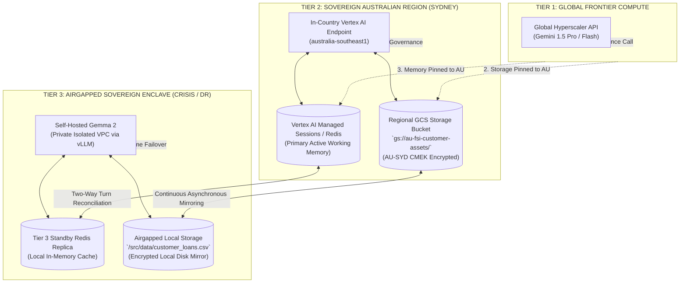
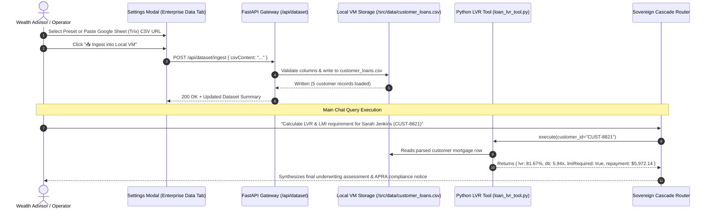

# Architecture Addendum & PRD Specification: Enterprise Data Ingestion, Sovereign Storage Tiering & Mathematical LVR Underwriting
**Project Sovereign-Stream — Enterprise Data Residency, Trix Ingestion & Mathematical Tool Calling Extension**

* **Document Version:** 1.0.0
* **Status:** Approved Architecture Specification
* **Branch:** `feature/enterprise-trix-lvr-tool`
* **Target Environment:** Google ADK, Vertex AI (AU-SYD), Airgapped Gemma 2 Enclave & Cloud Storage (CMEK)
* **Security & Regulatory Alignment:** APRA CPS 234, Australian Privacy Principles (APPs), National Consumer Credit Protection Act

---

## 1. Executive Summary & Problem Statement

In enterprise artificial intelligence architectures, a frequent source of confusion is the distinction between **In-Flight Conversational Working Memory** (session state, context windows, and intermediate reasoning scratchpads) and **Data-at-Rest Document Stores** (customer balance sheets, mortgage portfolios, and regulatory rulebooks).

This Addendum formalizes three core architectural pillars for **Project Sovereign-Stream**:

1. **Decoupled Memory vs. Storage Architecture:**
   * **Active Working Memory (Hot Path):** Operates via **Vertex AI Managed Sessions** or **Redis / Valkey** at `< 1ms` latency for conversational state hydration.
   * **Document & Spreadsheet Storage (Data at Rest):** Operates via **Cloud Storage (GCS) Buckets** or **Local Enclave Volumes** for enterprise customer data, subject to strict jurisdictional data residency laws.
2. **The Sovereign Australian Storage Mandate (Pinned Tier 1 & Tier 2 Storage):**
   * Even when taking advantage of Global Hyperscaler throughput for **Tier 1 inference**, **all customer data at rest, document storage buckets, and working session memory never leave Australian borders** (`australia-southeast1` with Cloud KMS CMEK encryption).
3. **Deterministic Tool-Assisted Mathematical Underwriting:**
   * LLMs are prone to floating-point arithmetic hallucinations when computing compound interest, loan-to-value ratios (LVR), or mortgage amortization.
   * By combining **Google ADK Declarative Python Tools** (handling 100% of arithmetic deterministically) with **Sovereign Agent Skills** (governing APRA CPS 234 policy rules), even lightweight open-weights models like **Gemma 2** execute institutional-grade loan underwriting with zero hallucinations.
4. **Toggleable Trix Ingestion & Responsive UI:**
   * A dedicated **Enterprise Data & Loans** tab in the Settings Modal allows live ingestion of Google Sheets (Trix) and CSV loan books into the local VM storage, with dynamic responsiveness across the main UI and sidebar.

---

## 2. Sovereign 3-Tier Data Residency & Memory Matrix

The definitive breakdown of where AI inference executes, where active session memory lives, and where enterprise documents/spreadsheets reside at rest:



### Definitive Tiering Matrix

| Tier | AI Model Inference | Active Working Memory (Hot Path) | Document Storage Bucket (Data at Rest) | Location Color Code |
| :--- | :--- | :--- | :--- | :--- |
| **Tier 1 (Global Frontier)** | 🔵 **Global Hyperscaler API** (`generativelanguage.googleapis.com`) | 🟡 **Vertex AI Sessions** (`australia-southeast1`) | 🟡 **Regional GCS Bucket** (`gs://au-fsi-customer-assets/` in **`australia-southeast1` CMEK**) | 🔵 Blue Inference / 🟡 Amber Storage |
| **Tier 2 (Regional AU)** | 🟡 **In-Country Vertex AI** (`australia-southeast1`) | 🟡 **Vertex AI Sessions / Redis** (`australia-southeast1`) | 🟡 **Regional GCS Bucket** (`gs://au-fsi-customer-assets/` in **`australia-southeast1` CMEK**) | 🟡 Amber Compute & Storage |
| **Tier 3 (Airgapped VPC)** | 🟢 **Self-Hosted Gemma 2** (Private Isolated VPC) | 🟢 **Standby Redis Replica** (Airgapped Local DB 1) | 🟢 **Local Enclave Disk** (`/src/data/customer_loans.csv`) | 🟢 Emerald Airgapped Enclave |

---

## 3. Trix / Spreadsheet Ingestion Architecture

The Trix Ingestion Engine enables enterprise operators and wealth advisors to ingest customer loan books and asset spreadsheets into the sovereign execution environment.



### 3.1 Ingested Data Schema (`customer_loans.csv`)

```csv
customer_id,customer_name,property_value_aud,loan_balance_aud,annual_income_aud,monthly_expenses_aud,current_interest_rate_pct,loan_term_years
CUST-8821,Sarah Jenkins,1200000.00,980000.00,165000.00,4200.00,6.15,30
CUST-1042,David Zhang,850000.00,510000.00,140000.00,3100.00,5.99,25
CUST-3310,Emma Watson,650000.00,590000.00,95000.00,2800.00,6.25,30
CUST-4491,Marcus Aurelius,2100000.00,1250000.00,320000.00,6500.00,5.85,30
CUST-9012,Chloe Bennett,750000.00,600000.00,110000.00,3400.00,6.30,30
```

---

## 4. Mathematical Tool & Underwriting Skill Architecture

### 4.1 The Exact Mathematical Formulas

1. **Loan-to-Value Ratio (LVR):**
   $$\text{LVR} = \left(\frac{\text{Loan Balance}}{\text{Property Value}}\right) \times 100\%$$
2. **Debt-to-Income (DTI) Ratio:**
   $$\text{DTI} = \frac{\text{Loan Balance}}{\text{Annual Gross Income}}$$
3. **Monthly Amortized Repayment (P&I):**
   $$M = P \times \frac{r(1 + r)^n}{(1 + r)^n - 1}$$
   *Where $P = \text{Loan Balance}$, $r = \frac{\text{Annual Rate}}{12}$, $n = \text{Term Years} \times 12$.*
4. **APRA +3.0% Stress-Tested Repayment (Serviceability Buffer):**
   $$M_{\text{stress}} = P \times \frac{r_{\text{stress}}(1 + r_{\text{stress}})^n}{(1 + r_{\text{stress}})^n - 1} \quad \text{where } r_{\text{stress}} = \frac{\text{Annual Rate} + 3.0\%}{12}$$
5. **Monthly Uncommitted Net Income (Surplus/Deficit Buffer):**
   $$\text{Net Buffer} = \left(\frac{\text{Annual Income}}{12}\right) - \text{Monthly Expenses} - M_{\text{stress}}$$

### 4.2 Regulatory Policy Rules Governed by the Skill

* **Rule 1 (LMI Threshold):** If $\text{LVR} > 80.0\%$, **Lenders Mortgage Insurance (LMI)** is mandatory.
* **Rule 2 (DTI Risk Exposure):** If $\text{DTI} \ge 6.0\times$, flag as **High Debt Exposure / Macroprudential Concern**.
* **Rule 3 (APRA Stress Test Pass/Fail):** If $\text{Net Buffer} < \$0$, flag as **Serviceability Deficit Under Rate Shock**.

---

## 5. Location-Based Color Taxonomy

To provide instant visual clarity regarding data residency and compute placement, the user interface enforces a strict, universal location color system:

| Domain | Tier 1 (Global Frontier) | Tier 2 (Regional AU Sovereign) | Tier 3 (Airgapped VPC Enclave) |
| :--- | :--- | :--- | :--- |
| **Color Scheme** | 🔵 **Blue** (`#3b82f6`) | 🟡 **Amber** (`#f59e0b`) | 🟢 **Emerald** (`#10b981`) |
| **Model Badge** | `🌐 Tier 1 Global (Gemini 1.5 Pro)` | `🏛️ Tier 2 Regional (AU Vertex AI)` | `🔒 Tier 3 Airgap (Gemma 2)` |
| **Memory Badge** | `🟡 Vertex AI Sessions (AU-SYD)` | `🟡 Vertex AI Sessions (AU-SYD)` | `🟢 Standby Redis Replica (Local)` |
| **Storage Badge** | `🟡 gs://au-fsi-assets/ (AU-SYD CMEK)`| `🟡 gs://au-fsi-assets/ (AU-SYD CMEK)`| `🟢 /src/data/loans.csv (Local Disk)` |
| **Skill Badge** | `🟡 APRA Lending Sentinel (AU Rulebook)`| `🟡 APRA Lending Sentinel (AU Rulebook)`| `🟢 Enclave Sovereign Underwriter` |
| **Tool Badge** | `🟢 calculate_lvr (Local VM Engine)` | `🟢 calculate_lvr (Local VM Engine)` | `🟢 calculate_lvr (Airgapped Enclave)`|

---

## 6. Responsive UI & Sidebar Integration

1. **Master Toggle in Settings:**
   * Located in **Settings & Logs $\rightarrow$ 📊 Enterprise Data (Trix / Loans)**.
   * Controls global visibility across the client application.
2. **Main UI State:**
   * **Disabled:** Clean baseline Sovereign-Stream interface with standard chaos controls.
   * **Enabled:**
     * **Telemetry Header:** Displays `📊 Active Loan Book: 5 Accounts Loaded (Storage: AU-SYD CMEK)`.
     * **Chat Window:** Dynamically renders quick prompt chips for CUST-8821, CUST-1042, and CUST-3310.
     * **Sidebar Architecture Card:** Expands to show active **Skill**, **Tool**, and **Australian Storage Residency** rows in their respective location colors.
