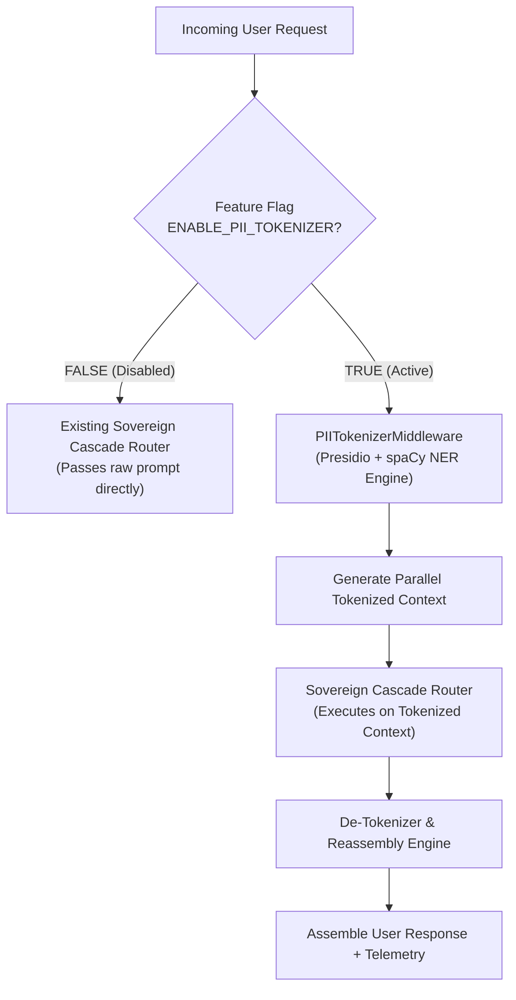
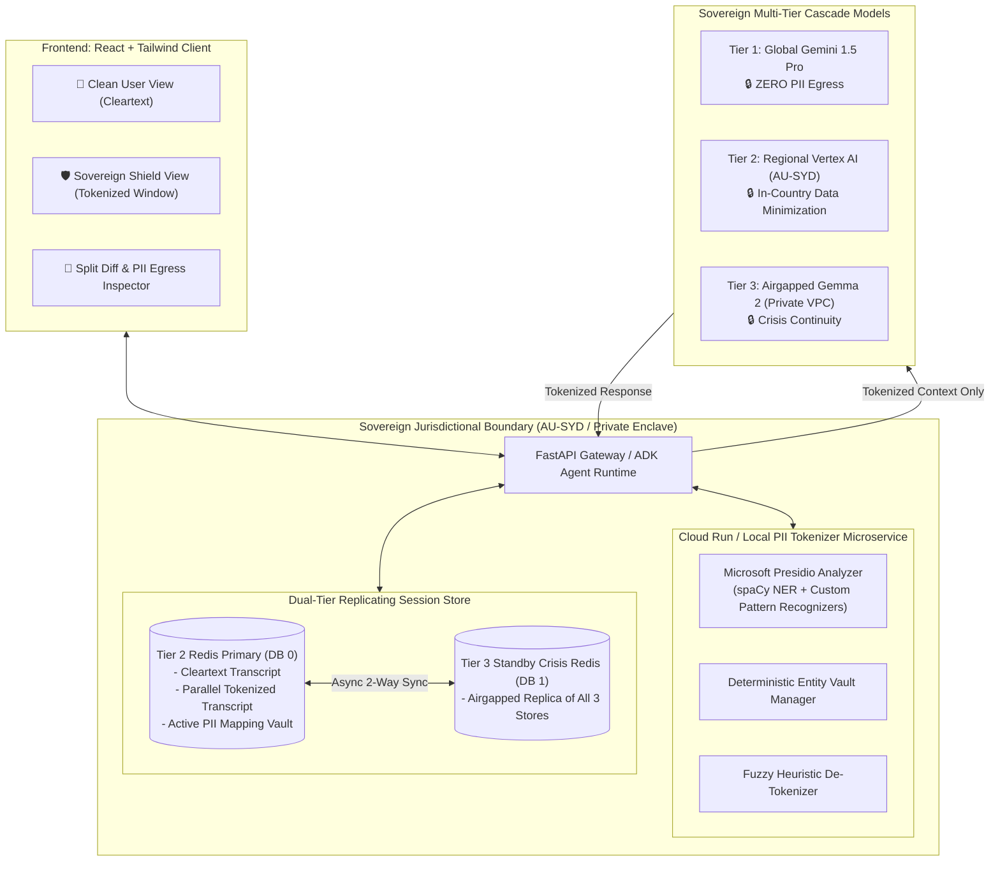

# Architecture Addendum & PRD Specification: Sovereign PII Tokenization & Parallel Context Window
**Project Sovereign-Stream — Enterprise Privacy & Data Residency Extension**

* **Document Version:** 1.0.0
* **Status:** Approved Architecture Specification
* **Target Environment:** Google ADK, Vertex AI (AU-SYD), Airgapped Gemma 2 Enclave & Cloud Run
* **Security & Regulatory Alignment:** APRA CPS 234, Australian Privacy Act 1988 (APPs), GDPR Art. 32, HIPAA

---

## 1. Executive Summary & Problem Statement

Enterprises in regulated industries (Banking/FSI, Healthcare, Public Sector) are frequently restricted from using Global Hyperscaler Frontier Models (Gemini 1.5 Pro / Flash) due to cross-border data transfer regulations and strict PII egress constraints.

This Addendum specifies a **completely modular, zero-overhead, feature-toggled PII Tokenization & Parallel Context Window Subsystem**. 

### The Core Breakthrough
1. **Zero-PII Model Inference:** All raw PII (Names, Account IDs, TFNs, Credit Cards, Emails, Phones) is intercepted within the sovereign jurisdictional boundary (Cloud Run / Local Enclave) and replaced with deterministic, high-entropy tokens (`[[PII_PERSON_1_7A]]`) before being dispatched to any LLM.
2. **Parallel Context Windows:** The system maintains two synchronized conversation contexts:
   * **Cleartext Context Window (User-Facing / Secure Vault):** Canonical conversation history displayed to the authenticated user and preserved for sovereign compliance audits.
   * **Tokenized Context Window (Model-Facing):** Anonymized representation sent across model boundaries (Tier 1 Global, Tier 2 Regional, Tier 3 Airgap).
3. **Resilient Reassembly Engine:** When models respond using tokens, an in-enclave de-tokenizer reassembles the text into natural cleartext for the end-user.
4. **100% Backward Compatibility & Feature-Toggled Safety:** When disabled, the runtime bypasses all tokenization with zero performance or schema impact on the existing 3-tier cascade router.

---

## 2. Feature Flagging & Modular Isolation Strategy

To ensure absolute safety and prevent interference with existing Sovereign-Stream capabilities:



### Configuration Matrix & Environment Knobs

| Config Variable | Type | Default | Purpose |
| :--- | :--- | :--- | :--- |
| `SOVEREIGN_ENABLE_PII_TOKENIZATION` | `bool` | `false` | Master backend switch. When `false`, zero tokenization code is executed. |
| `SOVEREIGN_PII_ENGINE` | `enum` | `presidio` | `presidio` (local spaCy/regex) or `google_dlp` (Cloud DLP API) |
| `SOVEREIGN_PII_SALT` | `string` | `auto` | 2-byte session salt (e.g. `7F`) preventing token collisions across concurrent users |
| `SOVEREIGN_PII_SERVICE_URL` | `string` | `http://127.0.0.1:8002` | Optional Cloud Run microservice endpoint; falls back to in-process engine if unreachable |

---

## 3. High-Level System Architecture



---

## 4. Product Requirements Document (PRD)

### 4.1 Functional Requirements

* **FR-1: Automatic Multi-Entity PII Detection**
  The system MUST identify standard and jurisdictional PII without manual tagging:
  * Global: `PERSON`, `EMAIL_ADDRESS`, `PHONE_NUMBER`, `CREDIT_CARD`, `LOCATION`, `IBAN_CODE`, `IP_ADDRESS`.
  * Australian Sovereignty Pack: `AU_TFN` (Tax File Number), `AU_MEDICARE`, `AU_BSB_ACCOUNT`.
* **FR-2: Deterministic Session Token Mapping**
  * The system MUST map identical entities to the exact same token within a session (e.g. "John Smith" is consistently `[[PII_PERSON_1_7A]]` in Turn 1 and Turn 10).
  * Unique tokens MUST use the salted format `[[PII_<TYPE>_<INDEX>_<SALT>]]` to ensure zero collision with normal prompts.
* **FR-3: Parallel Context Window Persistence**
  * `SessionState` MUST maintain two distinct context representations:
    * `session_state.messages`: Canonical cleartext history for the user and sovereign audit logs.
    * `session_state.tokenized_messages`: Anonymized history delivered to LLMs.
    * `session_state.pii_vault`: Key-value registry mapping token keys to encrypted/protected raw values.
* **FR-4: Multi-Tier Failover Continuity**
  * If a turn fails over mid-request from Tier 1 $\rightarrow$ Tier 2 $\rightarrow$ Tier 3, the fallback model MUST receive the identical tokenized context window.
  * The PII Vault MUST replicate asynchronously between Tier 2 Redis (DB 0) and Tier 3 Redis (DB 1) via `ReplicatingSessionService`.
* **FR-5: Resilient De-Tokenization & Mutation Healing**
  * The de-tokenizer MUST employ fuzzy regex matching to automatically heal LLM bracket mutations (e.g. `{PII_PERSON_1}`, `[[pii_person_1]]`, `[[PII_PERSON_1's]]`).
* **FR-6: Local Tool Calling Parameter Resolution**
  * When executing local typed Python tools (e.g. `get_account_balance`), the ADK tool runner MUST de-tokenize arguments prior to local execution, and re-tokenize tool output before appending to the model's history.
* **FR-7: Dual-View Chat UI Inspector**
  * The frontend MUST provide a 3-way view switcher in the chat window:
    1. **User View:** Natural, de-tokenized conversation.
    2. **Sovereign Shield View:** Raw tokenized context with syntax-highlighted token badges.
    3. **Diff View:** Side-by-side comparison of cleartext vs. model context.

### 4.2 Non-Functional Requirements

* **NFR-1 (Latency):** PII scanning and tokenization MUST complete in $\le 25\text{ms}$ on CPU.
* **NFR-2 (Airgap Compliance):** The Presidio + spaCy tokenizer MUST execute completely offline inside the sovereign container/enclave without outbound internet calls.
* **NFR-3 (Strict Zero-Trust & Zero PII Bleed):** PII tokenization is strictly enforced across **all three tiers** (Tier 1 Global, Tier 2 Regional, and Tier 3 Airgapped Enclave). Raw PII MUST NEVER bleed into any model context, local vLLM/Ollama logs, or GPU KV caches. In the event of a tokenization exception, the gateway MUST fail securely by aborting the turn (HTTP 422) before unredacted text can reach any model layer.


---

## 5. Data Structures & Schema Additions

### 5.1 Extended `SessionState` Model
```json
{
  "session_id": "session-1724220000",
  "stickyTier": "TIER_1_GLOBAL",
  "messages": [
    {
      "role": "user",
      "content": "Transfer $500 from John Smith's account 123-456 to Jane Doe."
    },
    {
      "role": "model",
      "content": "Transferred $500 from account 123-456 (John Smith) to Jane Doe successfully."
    }
  ],
  "tokenized_messages": [
    {
      "role": "user",
      "content": "Transfer $500 from [[PII_PERSON_1_7A]]'s account [[PII_ACC_1_7A]] to [[PII_PERSON_2_7A]]."
    },
    {
      "role": "model",
      "content": "Transferred $500 from account [[PII_ACC_1_7A]] ([[PII_PERSON_1_7A]]) to [[PII_PERSON_2_7A]] successfully."
    }
  ],
  "pii_vault": {
    "PII_PERSON_1_7A": { "raw": "John Smith", "type": "PERSON", "confidence": 0.95 },
    "PII_ACC_1_7A": { "raw": "123-456", "type": "AU_BSB_ACCOUNT", "confidence": 0.90 },
    "PII_PERSON_2_7A": { "raw": "Jane Doe", "type": "PERSON", "confidence": 0.94 }
  }
}
```

### 5.2 Extended `ExecutionMetadata` Frontend Telemetry
```typescript
export interface PIIEntityRecord {
  type: string;
  token: string;
  maskedSnippet: string;
  confidence: number;
}

export interface PIITelemetry {
  enabled: boolean;
  entitiesIntercepted: number;
  scanDurationMs: number;
  entities: PIIEntityRecord[];
  tokenizedPrompt: string;
  tokenizedResponse: string;
  zeroEgressVerified: boolean;
}
```

---

## 6. Verification & Test Plan

1. **Unit Tests (`tests/test_pii_tokenizer.py`):**
   * Verifies detection accuracy for names, emails, phones, and Australian TFNs.
   * Verifies deterministic mapping across multiple sequential strings.
   * Verifies fuzzy de-tokenization against bracket, casing, and possessive mutations.
2. **Integration Tests (`tests/test_parallel_context_cascade.py`):**
   * Verifies that `cascade_router` dispatches only tokenized prompts to mock Gemini / Gemma endpoints.
   * Verifies that failover hops across Tiers 1 $\rightarrow$ 2 $\rightarrow$ 3 maintain identical token values.
   * Verifies that tool executions receive de-tokenized values and return sanitized outputs.
3. **Storage Replication Tests:**
   * Verifies that `pii_vault` is asynchronously mirrored to Redis DB 1 (Tier 3 standby).
