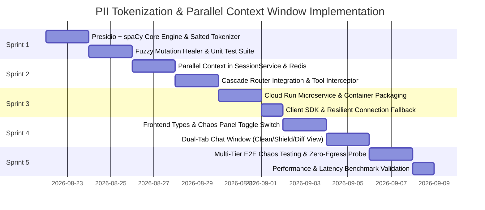

# Comprehensive Implementation Plan: Sovereign PII Tokenizer & Parallel Context Window
**Project Sovereign-Stream — Feature Branch: `feature/pii-tokenizer-parallel-context`**

* **Status:** Ready for Execution
* **Architecture Base:** [docs/PII_TOKENIZATION_ARCHITECTURE_ADDENDUM.md](file:///usr/local/google/home/mattpancino/dev/sovereignagent/docs/PII_TOKENIZATION_ARCHITECTURE_ADDENDUM.md)
* **Visual Reference:** [docs/pii-architecture-slide.html](file:///usr/local/google/home/mattpancino/dev/sovereignagent/docs/pii-architecture-slide.html)

---

## 1. Branch Strategy & Isolation Principles

All work is isolated on the new dedicated branch:
```bash
git checkout -b feature/pii-tokenizer-parallel-context
```

### Safety & Backward-Compatibility Invariants
1. **Zero Breaking Changes:** Existing routes (`/api/chat`, `/api/models`, `/api/settings`) maintain 100% backward compatibility.
2. **Feature Toggled by Default:** If `enablePiiTokenizer` is `false` (default), the execution path completely bypasses tokenization without modifying message payload structures or incurring latency.
3. **Pluggable Architecture:** The PII Tokenizer engine can run as a **local in-process Python module** or as a **remote Cloud Run microservice**, switching seamlessly based on configuration.

---

## 2. Sprint Roadmap & Work Breakdown Structure



---

## 3. Detailed Sprint Specifications

### 🏃 Sprint 1: Core PII Tokenizer Engine & Resilient Vault Manager
* **Objective:** Implement the standalone Python tokenizer module with Microsoft Presidio, spaCy NER, Australian banking recognizers, and the fuzzy mutation healer.
* **Deliverables:**
  1. `src/adk/pii_tokenizer.py`:
     * `SovereignPIITokenizer` class implementing `tokenize()`, `detokenize()`, and `heal_mutations()`.
     * Deterministic salted token format: `[[PII_<TYPE>_<INDEX>_<SALT>]]`.
     * Presidio recognizers for standard entities + custom Australian banking recognizers (`AU_TFN`, `AU_MEDICARE`, `AU_BSB_ACCOUNT`).
  2. `tests/test_pii_tokenizer.py`:
     * Unit tests covering entity detection, multi-string deterministic stability, session salt isolation, and bracket/casing/possessive mutation healing.
* **Acceptance Criteria:**
  * 100% test pass rate with $< 20\text{ms}$ scan time per prompt.

---

### 🏃 Sprint 2: Parallel Context Pipeline & Dual-Tier Session Integration
* **Objective:** Integrate the tokenizer into `SessionService`, `BaseAgent`, and `CascadeRouter` to maintain parallel context windows and handle tool de-tokenization.
* **Deliverables:**
  1. `src/adk/session_service.py`:
     * Add `tokenized_messages` and `pii_vault` to `SessionState`.
     * Ensure `ReplicatingSessionService` replicates `pii_vault` between Tier 2 Redis (DB 0) and Tier 3 Redis (DB 1).
  2. `src/adk/cascade_router.py` & `src/adk/base_agent.py`:
     * Pre-inference tokenization hook to construct tokenized payload for models.
     * Post-inference de-tokenization hook to restore cleartext before saving to `messages`.
     * Tool calling interceptor: De-tokenizes arguments before tool execution, and tokenizes tool results before returning to the model.
  3. `tests/test_parallel_context_cascade.py`:
     * Verifies models receive only tokenized prompts.
     * Verifies that mid-turn failovers (Tier 1 $\rightarrow$ Tier 2 $\rightarrow$ Tier 3) retain identical token mappings.
* **Acceptance Criteria:**
  * Zero PII passed to external model mock handlers; session vault mirrors correctly across Redis DB 0 and DB 1.

---

### 🏃 Sprint 3: Cloud Run Microservice & Enclave Container
* **Objective:** Package the tokenizer engine as an independent microservice for deployment to Google Cloud Run, with graceful in-process fallback.
* **Deliverables:**
  1. `src/services/pii_tokenizer/`:
     * `main.py`: FastAPI server exposing `/v1/tokenize`, `/v1/detokenize`, and `/health`.
     * `Dockerfile`: Multi-stage lightweight container with pre-downloaded spaCy models.
     * `requirements.txt`: Minimal dependencies for fast cold starts.
  2. `scripts/deploy_pii_cloud_run.sh`: Automated gcloud build and Cloud Run deployment script.
  3. Client HTTP wrapper in `src/adk/pii_tokenizer.py` with automatic fallback to local engine if service is offline.
* **Acceptance Criteria:**
  * Service responds to `/health` in $< 5\text{ms}$; handles 100 concurrent requests without failure.

---

### 🏃 Sprint 4: Frontend Dual-Context Inspector & Sovereign Shield UI
* **Objective:** Build the interactive UI tabs and telemetry cards in the React/Tailwind frontend.
* **Deliverables:**
  1. `src/frontend/src/types.ts`:
     * Add `PIITelemetry` (`entitiesIntercepted`, `scanDurationMs`, `entities`, `tokenizedPrompt`, `zeroEgressVerified`).
     * Add `enablePiiTokenizer` flag to `SimulationControls`.
  2. `src/frontend/src/components/ChatWindow.tsx`:
     * Tab Switcher at the top of the chat:
       * 💬 **Clean User View** (cleartext).
       * 🛡️ **Sovereign Shield View** (tokenized context with styled entity chips).
       * 🔀 **Split / Diff View** (side-by-side comparison).
     * Telemetry Accordion: Add "🛡️ Zero-PII Egress Shield" telemetry card showing scan duration and intercepted entities.
  3. `src/frontend/src/components/ChaosPanel.tsx`:
     * Add toggle switch: `[ ] Enable Sovereign PII Tokenizer`.
* **Acceptance Criteria:**
  * User can switch tabs dynamically without reloading; UI clearly visualizes the difference between what the user typed and what the model saw.

---

### 🏃 Sprint 5: Comprehensive Verification, Chaos Testing & Benchmarks
* **Objective:** Full end-to-end testing, chaos failure injection, and performance validation.
* **Deliverables:**
  1. `scripts/verify_zero_pii_egress.py`: Automated audit probe testing that no names, account numbers, or TFNs ever appear in outbound model payload logs.
  2. Chaos test cases:
     * Model bracket mutation injection (testing the fuzzy healer).
     * Sudden Tier 1 timeout failover to Tier 3 during a tokenized turn.
     * Replicating Redis recovery test with PII vault synchronization.
  3. Performance report: Verify tokenization adds $< 25\text{ms}$ total turn latency.
* **Acceptance Criteria:**
  * All test suites passing (`pytest tests/`).
  * 0.00% PII detected in external payload logs.
