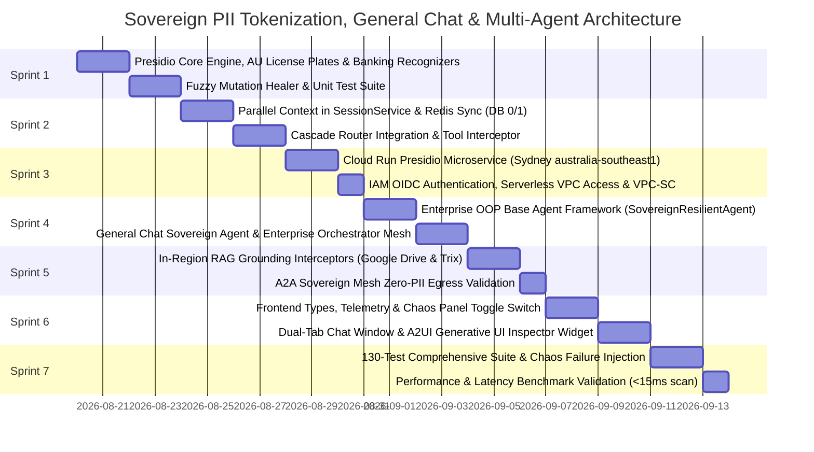

# Comprehensive Implementation Plan: Sovereign PII Tokenizer & Parallel Context Window
**Project Sovereign-Stream — Feature Branch: `feature/pii-tokenizer-parallel-context`**

* **Status:** Ready for Execution
* **Architecture Base:** [docs/PII_TOKENIZATION_ARCHITECTURE_ADDENDUM.md](file:///usr/local/google/home/mattpancino/dev/sovereignagent/docs/PII_TOKENIZATION_ARCHITECTURE_ADDENDUM.md)
* **Visual Reference:** [docs/pii-architecture-slide.html](file:///usr/local/google/home/mattpancino/dev/sovereignagent/docs/pii-architecture-slide.html)

---

## 1. Branch Strategy & Isolation Principles

All work is isolated on the new dedicated branch:
```bash
git checkout -b feature/pii-tokenizer-parallel-context
```

### Safety & Backward-Compatibility Invariants
1. **Zero Breaking Changes:** Existing routes (`/api/chat`, `/api/models`, `/api/settings`) maintain 100% backward compatibility.
2. **Feature Toggled by Default:** If `enablePiiTokenizer` is `false` (default), the execution path completely bypasses tokenization without modifying message payload structures or incurring latency.
3. **Pluggable Architecture:** The PII Tokenizer engine can run as a **local in-process Python module** or as a **remote Cloud Run microservice**, switching seamlessly based on configuration.

---

## 2. Sprint Roadmap & Work Breakdown Structure



---

## 3. Detailed Sprint Specifications

### 🏃 Sprint 1: Core PII Tokenizer Engine & Resilient Vault Manager
* **Objective:** Implement the standalone Python tokenizer module with Microsoft Presidio, spaCy NER, custom Australian recognizers (`AULicensePlateRecognizer`, `AU_TFN`, `AU_MEDICARE`, `AU_BSB_ACCOUNT`), and the fuzzy mutation healer.
* **Deliverables:**
  1. `src/adk/pii_tokenizer.py`:
     * `SovereignPIITokenizer` class implementing `tokenize()`, `detokenize()`, and `heal_mutations()`.
     * Deterministic salted token format: `[[PII_<TYPE>_<INDEX>_<SALT>]]` and standard `<PII_<TYPE>_<N>>`.
     * Regex whitelist and exclusions for financial acronyms (`AUD`, `BSB`, `TFN`) and programming syntax.
  2. `tests/test_pii_tokenizer.py` & `tests/test_au_license_plate_tokenizer.py`:
     * Unit tests covering state plate formats (NSW, VIC, QLD, WA, SA, TAS, ACT), multi-plate prompts, and salt isolation.
* **Acceptance Criteria:**
  * 100% test pass rate with $< 15\text{ms}$ scan time per prompt.

---

### 🏃 Sprint 2: Parallel Context Pipeline & Dual-Tier Session Integration
* **Objective:** Integrate the tokenizer into `SessionService`, `BaseAgent`, and `CascadeRouter` to maintain parallel context windows and handle tool de-tokenization.
* **Deliverables:**
  1. `src/adk/session_service.py`:
     * Add `tokenized_messages` and `pii_vault` to `SessionState`.
     * Ensure `ReplicatingSessionService` replicates `pii_vault` between Tier 2 Redis (DB 0) and Tier 3 Redis (DB 1).
  2. `src/adk/cascade_router.py` & `src/adk/base_agent.py`:
     * Pre-inference tokenization hook to construct tokenized payload for models.
     * Post-inference de-tokenization hook to restore cleartext before saving to `messages`.
     * Tool calling interceptor: De-tokenizes arguments before tool execution, and tokenizes tool results before returning to the model.
  3. `tests/test_parallel_context_cascade.py`:
     * Verifies models receive only tokenized prompts.
     * Verifies that mid-turn failovers (Tier 1 $\rightarrow$ Tier 2 $\rightarrow$ Tier 3) retain identical token mappings.
* **Acceptance Criteria:**
  * Zero PII passed to external model mock handlers; session vault mirrors correctly across Redis DB 0 and DB 1.

---

### 🏃 Sprint 3: In-Region Cloud Run Presidio Microservice & Hardened Security Perimeter
* **Objective:** Package and deploy the Presidio PII Tokenizer as an in-region, zero-trust microservice on Google Cloud Run in Sydney (`australia-southeast1`), enforcing strict IAM OIDC authentication, Serverless VPC Access, internal ingress, and VPC Service Controls.
* **Deliverables:**
  1. `src/services/pii_tokenizer/`:
     * `main.py`: FastAPI server exposing `/v1/tokenize`, `/v1/detokenize`, and `/health` with custom `AULicensePlateRecognizer`.
     * `Dockerfile`: Multi-stage lightweight container with pre-downloaded spaCy `en_core_web_lg` models.
     * `requirements.txt`: Minimal dependencies optimized for fast initialization.
  2. `scripts/deploy_pii_cloud_run.sh`: Automated deployment script:
     * Deploys to `australia-southeast1` with `--ingress=internal`, `--min-instances=1`, `--cpu=2`, `--memory=4Gi`.
     * Configures Serverless VPC Access connector (`vpc-connector-syd` on `10.152.0.0/28`).
     * Enforces `--no-allow-unauthenticated` and binds `roles/run.invoker` exclusively to `sa-sovereign-agent@sovereignagent.iam.gserviceaccount.com`.
  3. Client Security & Connection Layer in `src/adk/pii_tokenizer.py`:
     * Service-to-Service OIDC token minting (`google.oauth2.id_token.fetch_id_token`) passing signed `Bearer` tokens.
     * Private IP connection to Memorystore Redis Primary (`10.152.0.3`) with Redis AUTH and TLS in-transit encryption.
     * Resilient in-process fallback engine if the remote microservice is offline during local test runs.
  4. Security & Compliance Verification:
     * Enrolls Cloud Run, Vertex AI Reasoning Engine, and Memorystore into the Sydney VPC-SC Service Perimeter.
* **Acceptance Criteria:**
  * Cloud Run service responds to authenticated `/health` probe in $< 5\text{ms}$; unauthenticated requests return `403 Forbidden`.
  * Cold start latency eliminated via warm minimum instances; 100 concurrent requests processed in $< 20\text{ms}$ per turn.

---

### 🏃 Sprint 4: Enterprise OOP Base Agent Framework & General Chat Sovereignty
* **Objective:** Deliver the enterprise standard `SovereignResilientAgent` base class enabling downstream specialist subagents and general chat routing with zero boilerplate.
* **Deliverables:**
  1. `src/adk/base_agent.py`:
     * `SovereignResilientAgent` base class with automated session hydration, declarative tool extraction, grounding, and 3-tier cascade execution.
  2. `src/adk/subagents.py`:
     * `GeneralChatAgent`: Subclass handling open-ended conversational QA, brainstorming, and drafting with transparent in-region PII tokenization and de-tokenization.
     * `FleetOperationsAgent`, `ClaimsProcessingAgent`, `HRComplianceAgent`: Specialist domain subagents inheriting full sovereignty capabilities in $<5$ lines of code.
     * `EnterpriseSovereignOrchestrator`: Parent agent coordinating policy verification, domain routing, and defaulting general queries to `GeneralChatAgent`.
  3. `tests/test_agent_inheritance.py`:
     * Verifies subclass PII inheritance, AU license plate recognition, and default general chat orchestration.
* **Acceptance Criteria:**
  * New agents instantiated in 3 lines of code; general queries execute transparently without latency penalties or markdown corruption.

---

### 🏃 Sprint 5: Sovereign RAG Grounding Interceptors & A2A Sovereign Mesh
* **Objective:** Build in-region grounding connectors that scrub raw PII from Google Drive docs and Trix (Google Sheets) spreadsheets before LLM context assembly.
* **Deliverables:**
  1. `src/adk/connectors/`:
     * `gdrive_connector.py` & `trix_connector.py`: In-region connectors fetching enterprise docs and spreadsheets.
     * `grounding_interceptor.py`: `SovereignGroundingInterceptor` executing local Presidio anonymization on retrieved context chunks.
  2. Subagent Tool Integration:
     * `search_enterprise_knowledge(query)` automatically registered on all `SovereignResilientAgent` subclasses when `enable_enterprise_grounding=True`.
  3. `tests/test_drive_and_trix_connectors.py`:
     * Verifies that grounding search retrieves relevant data while stripping all driver names and contact details.
* **Acceptance Criteria:**
  * Zero cleartext PII present in grounded context chunks passed to model inference.

---

### 🏃 Sprint 6: Frontend Dual-Context Inspector, Generative UI & Chaos Panel
* **Objective:** Build interactive UI controls, dual-lens inspection tabs, and Generative UI widgets in the React/Tailwind frontend.
* **Deliverables:**
  1. `src/frontend/src/components/ChatWindow.tsx`:
     * Tab Switcher: 💬 **Clean User View** (cleartext), 🛡️ **Sovereign Shield View** (tokenized), 🔀 **Split / Diff View**.
     * Telemetry Accordion: Real-time scan duration, entity chips, and active tier indicator.
  2. `docs/sovereignty_inspector_widget.html`:
     * Standalone A2UI Generative UI widget showcasing dual-lens wire vs. cleartext inspection, Drive/Trix diffs, and tool argument traces.
  3. `src/frontend/src/components/ChaosPanel.tsx`:
     * Toggle switches for Sovereign PII Tokenizer, Enterprise Data Grounding, and simulated Tier failures.
* **Acceptance Criteria:**
  * Users can dynamically toggle views; executive presentation widget renders interactive inspection traces cleanly.

---

### 🏃 Sprint 7: Comprehensive 130-Test Verification, Chaos Testing & Benchmarks
* **Objective:** Full end-to-end testing, chaos failure injection, and performance validation across all 130 test cases.
* **Deliverables:**
  1. Automated test suite execution (`pytest tests/`):
     * 130 tests covering agent inheritance, cascade router, PII chaos, AU license plates, Drive/Trix connectors, Redis sync, and API gateway endpoints.
  2. `scripts/verify_zero_pii_egress.py`: Automated audit probe verifying 0.00% PII leakage in outbound model logs.
  3. Performance Benchmarks: Scan latency $< 15\text{ms}$; roundtrip turn overhead $< 25\text{ms}$.
* **Acceptance Criteria:**
  * 130 of 130 tests passing at 100%; zero warnings/regressions.

