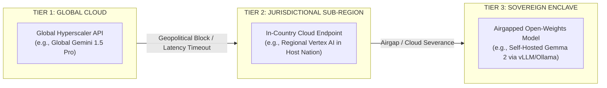
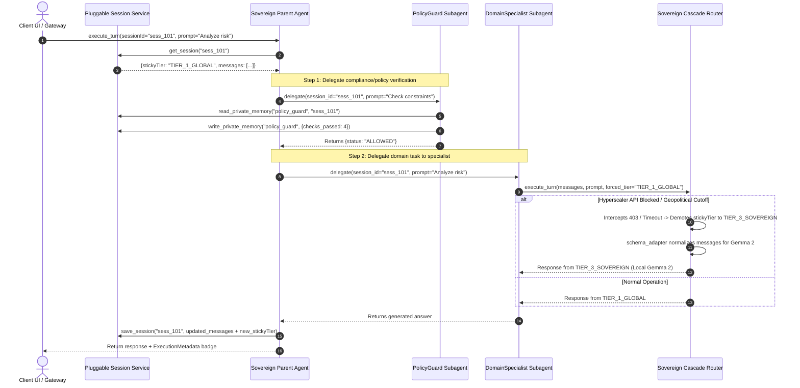

# Product Requirements Document (PRD)
## Project Sovereign-Stream: Universal Geopolitical AI Resilience & Autonomous Multi-Agent Framework

**Document Version:** 2.0.0  
**Author:** Sovereign-Stream Engineering Team  
**Status:** Approved Reference Specification  
**Scope:** Universal Sovereign AI Gateway & ADK Parent Agent Framework (Any Country or Jurisdiction)  

---

## 1. Executive Summary & Problem Statement

Modern enterprise AI applications increasingly rely on global hyperscaler model APIs (such as Gemini 1.5 Pro). However, enterprises operating in sensitive or regulated jurisdictions face significant operational risks:
* **Geopolitical & Jurisdictional Lockouts:** Access to global AI models can be restricted, rate-limited, or blocked by sudden policy changes, cross-border embargoes, or jurisdictional mandates.
* **Lack of Airgapped Continuity:** If external cloud model APIs are severed mid-conversation, most applications experience ungraceful HTTP 500 errors, lost conversation history, and complete operational failure.
* **Context Bleed in Multi-Agent Systems:** When multiple specialized AI agents collaborate on a user query, sharing a single unstructured memory buffer leads to leaked intermediate reasoning, token limit exhaustion, and security boundary violations.

**Project Sovereign-Stream** provides a universal **Agent Development Kit (ADK) Parent Agent Framework** that guarantees zero-loss conversational continuity by dynamically cascading from **Global Hyperscaler APIs** to **Jurisdictional Sub-Regional Endpoints** down to **Local Airgapped Open-Weights Models (Gemma 2)** in any country, while enforcing strict memory isolation across specialized agent teams.

---

## 2. Universal 3-Tier Sovereign Hierarchy

Sovereign-Stream abstracts AI model execution into three universal tiers that apply to any country or enterprise enclave:



1. **`TIER_1_GLOBAL` (Global Hyperscaler API):** The primary execution path during standard operations, offering the largest context windows and lowest cost/latency globally.
2. **`TIER_2_REGIONAL` (Jurisdictional Sub-Region):** Pinned to cloud infrastructure physically residing within the customer's specific national or jurisdictional boundary (e.g., Frankfurt for EU, Tokyo for Japan, Sydney for Australia, or US GovCloud).
3. **`TIER_3_SOVEREIGN` (Local Sovereign Enclave):** Completely self-hosted open-weights models (such as Gemma 2 9B/27B) running inside an isolated private VPC or on-premise infrastructure with zero external network egress or cloud API dependencies.

---

## 3. User Stories & Functional Requirements

### US-1: Universal Geopolitical Cascade & Sticky Demotion
* **As an enterprise operator**, I want the system to intercept any hyperscaler API failure, timeout, or geopolitical access restriction within 100ms and fail over to the next sovereign tier automatically.
* **Requirement 1.1:** The `SovereignCascadeRouter` must support configurable tier order: `TIER_1_GLOBAL` $\rightarrow$ `TIER_2_REGIONAL` $\rightarrow$ `TIER_3_SOVEREIGN`.
* **Requirement 1.2:** If an upper tier fails, the router must demote the session's `stickyTier` so subsequent user turns route directly to the healthy sovereign tier without repeating timeout penalties.

### US-2: Zero-Loss Context Preservation Across Failovers
* **As a user**, I want my active conversation to continue seamlessly when the system fails over from a global model to a local airgapped model without losing previous turns or receiving error screens.
* **Requirement 2.1:** The router must transmit the entire active conversation transcript (`messages`) on every turn regardless of which tier answers.
* **Requirement 2.2:** When cascading to `TIER_3_SOVEREIGN` (Gemma 2 / vLLM), the `schema_adapter` must translate message histories from proprietary hyperscaler roles (`model`, `user`) to open chat-completion roles (`assistant`, `user`, `system`) on the fly.

### US-3: Pluggable Session Service & Isolated Private Agent Memory
* **As a security architect**, I want specialized agents (e.g., Policy Evaluators, Domain Specialists) to collaborate on a session without exposing their private internal calculations or scratchpads to other agents.
* **Requirement 3.1:** Provide a pluggable `SessionService` interface with implementations for in-memory demo mode (`InMemorySessionService`) and production VPC backends (`RedisSessionService`).
* **Requirement 3.2:** The session store must maintain two distinct data namespaces:
  * **Shared Transcript (`session:<session_id>`):** User/assistant messages and operational routing state (`stickyTier`).
  * **Private Agent Memory (`private:<agent_name>:<session_id>`):** Agent-specific scratchpads and intermediate reasoning accessible only to that specific agent class.

### US-4: Parent Agent & Subagent Delegation via `sessionId`
* **As an ADK developer**, I want a standardized base class (`SovereignResilientAgent`) that acts as a Parent Agent capable of delegating scoped tasks to specialized subagents by passing only the `sessionId`.
* **Requirement 4.1:** The Parent Agent must provide a `delegate(subagent, session_id, prompt)` method that triggers a specialist subagent without copying or duplicating conversation histories in memory.
* **Requirement 4.2:** Any subagent invoked in the delegation chain must automatically inherit the session's active `stickyTier` routing constraint.

### US-5: Autonomous Sentinel Recovery
* **As an infrastructure engineer**, I want the system to continuously probe demoted upper tiers in the background and promote the session back to global/regional routing once geopolitical restrictions or outages lift.
* **Requirement 5.1:** The `RecoverySentinel` must execute out-of-band synthetic probes against demoted tiers without blocking active user traffic.
* **Requirement 5.2:** Promotion back to a higher tier requires meeting stability hysteresis criteria (e.g., 2 consecutive successful probes under a target latency SLA).

---

## 4. Multi-Agent Memory & Execution Architecture



---

## 5. Universal Policy Enums (`SovereigntyPolicy`)

To ensure global applicability across any customer or country, agent sovereignty policies are standardized into three universal modes:

```python
class SovereigntyPolicy(str, Enum):
    """Universal sovereignty routing constraint enforced on an agent."""
    GLOBAL_CASCADE = "GLOBAL_CASCADE"                      # Default 3-tier cascade (Tier 1 -> 2 -> 3)
    JURISDICTIONAL_OR_AIRGAP = "JURISDICTIONAL_OR_AIRGAP"  # Bypasses Global Tier 1, starts at Tier 2
    STRICT_AIRGAP_VPC_ONLY = "STRICT_AIRGAP_VPC_ONLY"      # Locks exclusively to Tier 3 Airgapped Enclave
```

---

## 6. Acceptance Criteria & Verification Plan

| Test ID | Scenario | Expected Outcome | Verification Method |
| :--- | :--- | :--- | :--- |
| **AC-01** | Hyperscaler Tier 1 returns HTTP 403 / 404 (Simulated Geopolitical Lockout). | Instant failover to Tier 2/3 within <100ms; session `stickyTier` updated; zero conversation context lost. | Automated pytest in `tests/test_cascade_router.py`. |
| **AC-02** | Schema adaptation during Tier 3 failover to self-hosted Gemma 2. | All Gemini `"model"` roles translated to `"assistant"`; system prompt prepended; valid JSON completion payload. | Automated pytest in `tests/test_schema_adapter.py`. |
| **AC-03** | Private memory isolation between `PolicyGuardAgent` and `DomainSpecialistAgent`. | Agent A's scratchpad (`private:policy_guard:...`) is inaccessible when Agent B reads shared session state. | Automated pytest in `tests/test_session_service.py`. |
| **AC-04** | Subagent delegation via `sessionId` across a multi-turn workflow. | Parent Agent delegates to subagent; subagent inherits active `stickyTier` and appends response cleanly. | Automated pytest in `tests/test_parent_agent.py`. |
| **AC-05** | Sentinel autonomous recovery after simulated outage resolves. | `RecoverySentinel` detects 2 consecutive healthy pings and promotes `stickyTier` back to primary tier. | Automated pytest in `tests/test_recovery_sentinel.py`. |
