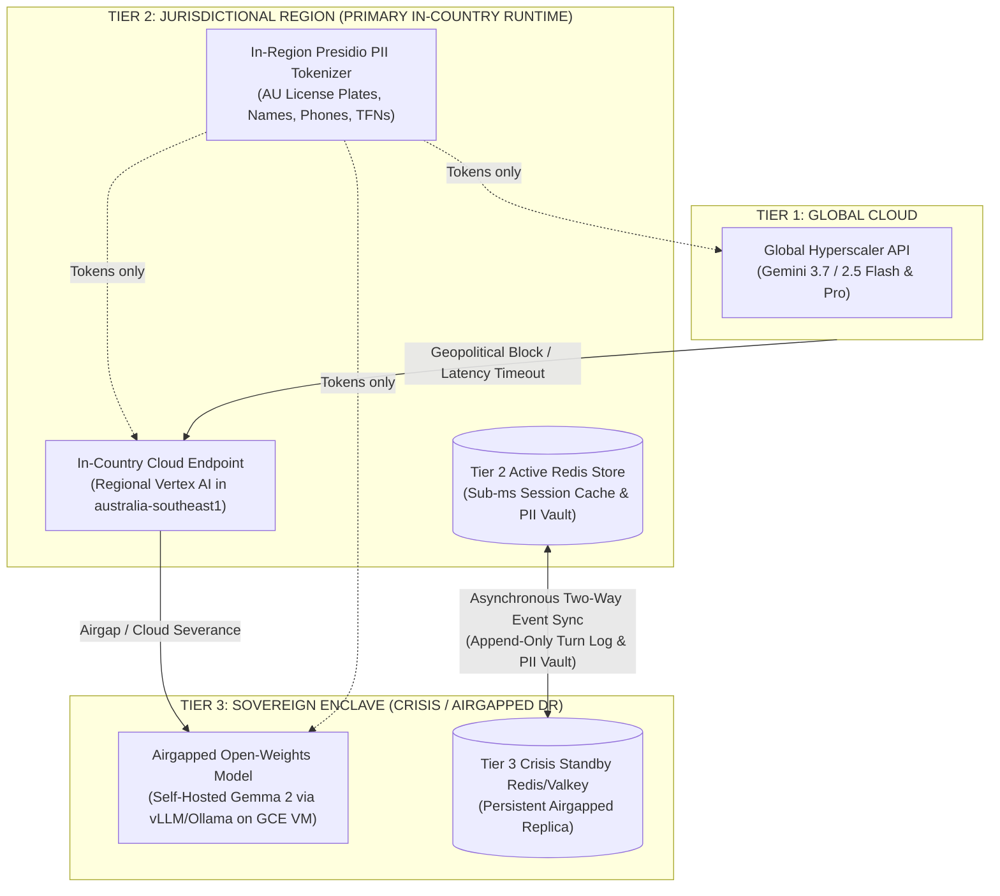
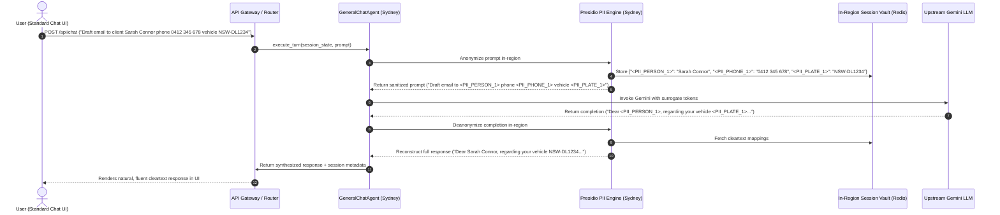
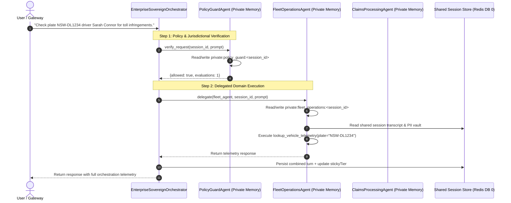
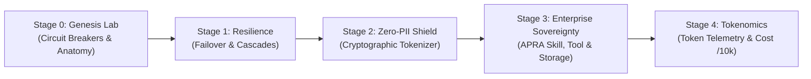

# Product Requirements Document (PRD)
## Project Sovereign-Stream: Universal Geopolitical AI Resilience, In-Region PII Sovereignty & Autonomous Multi-Agent Framework

**Document Version:** 4.0.0  
**Author:** Sovereign-Stream Engineering Team  
**Status:** Approved Reference Specification  
**Scope:** Universal Sovereign AI Gateway, Vertex AI Reasoning Engine, In-Region PII Tokenizer & Presidio Vault, Google Drive/Trix Grounding Interceptors, General Chat Routing, Enterprise Base Agent Framework & 3-Tier Replicating Redis Session Store  

---

## 1. Executive Summary & Problem Statement

Modern enterprise AI applications increasingly rely on global hyperscaler model APIs (such as Gemini 2.5/3.7 Flash and Pro). However, enterprises operating in sensitive, regulated, or sovereign jurisdictions face four major operational challenges:

1. **Geopolitical & Jurisdictional Lockouts:** Access to global cloud AI models can be restricted, rate-limited, or blocked by policy changes, international embargoes, or jurisdictional sovereignty mandates.
2. **Cross-Border Privacy & PII Compliance (e.g., Australian Privacy Principle APP 8):** Regulations strictly forbid un-tokenized Personally Identifiable Information (PII), vehicle telemetry, driver registrations, tax file numbers (TFNs), and customer banking details from egressing outside the national boundary (e.g., leaving Australia for overseas inference).
3. **Lack of Airgapped Continuity & Crisis Failover:** If external cloud model APIs are severed mid-conversation, most applications experience ungraceful HTTP 500 errors, lost conversation history, and complete operational failure.
4. **Developer Complexity in Multi-Agent State, RAG & Tooling:** Building enterprise multi-agent systems often forces developers to write hundreds of lines of boilerplate for session persistence, manual PII masking, grounding connectors, tool-schema parsing, memory isolation, and failover synchronization.

**Project Sovereign-Stream** provides an enterprise-grade platform runtime, SDK, and multi-tier sovereign gateway:
* **Zero-PII In-Region Pre-processing:** Presidio-powered local tokenization in Sydney (`australia-southeast1`) that pseudonymizes PII and Australian license plates before prompt egress and de-tokenizes responses locally.
* **Transparent General Chat Experience:** General conversational Q&A, drafting, and coding operate seamlessly in standard chat interfaces—appearing completely normal to users while strictly enforcing sovereign PII tokenization over the wire.
* **Enterprise OOP Agent Base Class (`SovereignResilientAgent`):** Downstream specialist subagents (`GeneralChatAgent`, `FleetOperationsAgent`, `ClaimsProcessingAgent`, `HRComplianceAgent`) automatically inherit PII pseudonymization, Drive/Trix grounding, declarative tool execution, and failover routing in 3 lines of code.
* **In-Region RAG Grounding Interceptors:** Transparent sanitization of Google Drive documents and Trix (Google Sheets) spreadsheets before LLM context injection.
* **Agent-to-Agent (A2A) Sovereign Mesh Governance:** Guarantees zero raw PII crosses agent or network boundaries during multi-agent collaboration.
* **3-Tier Sovereign Cascade Router & Replicating Session Store:** Automatic failover across Global Cloud, Jurisdictional Regional Cloud (Vertex AI), and Airgapped Sovereign On-Prem Enclaves (Gemma 2 / vLLM), backed by sub-millisecond Tier 2 Redis with asynchronous Tier 3 replication.

---

## 2. Universal 3-Tier Sovereign Hierarchy & Storage Replication

Sovereign-Stream abstracts both AI model execution and session state storage into three universal tiers:



1. **`TIER_1_GLOBAL` (Global Hyperscaler API):** The primary execution path for non-restricted global traffic, offering the largest context windows and lowest latency globally. Sensitive PII is tokenized in-region *before* transit.
2. **`TIER_2_REGIONAL` (Jurisdictional Sub-Region & Primary Sovereign Runtime):**
   * **Compute:** Pinned to cloud infrastructure physically residing within the national boundary (Sydney `australia-southeast1`) leveraging **Vertex AI** for standardized tool orchestration and model reasoning.
   * **PII Engine:** Houses the **Presidio Sovereign Tokenizer** with custom Australian recognizers (`AULicensePlateRecognizer`, phone, TFN, address) and Redis token vault.
   * **Storage:** Houses the active **Tier 2 Redis Primary**, delivering `< 1ms` read/write latency for conversation context and agent scratchpads.
3. **`TIER_3_SOVEREIGN` (Local Sovereign Crisis Enclave):**
   * **Compute:** Self-hosted open-weights models (Gemma 2 2B/9B/27B) running inside an isolated private VPC or on-premise infrastructure with zero external network dependencies.
   * **Storage:** Houses the **Tier 3 Standby Redis/Valkey** instance. During normal operations, Tier 2 asynchronously streams session updates and token vaults to Tier 3. During a cloud severance crisis, Tier 3 takes over as the active read/write store and synchronizes new turns back to Tier 2 upon reconnection.

---

## 3. User Stories & Functional Requirements

### US-1: Universal Geopolitical Cascade & Sticky Demotion
* **As an enterprise operator**, I want the system to intercept any hyperscaler API failure, timeout, or geopolitical access restriction within 100ms and fail over to the next sovereign tier automatically.
* **Requirement 1.1:** The `SovereignCascadeRouter` must support configurable tier order: `TIER_1_GLOBAL` $\rightarrow$ `TIER_2_REGIONAL` $\rightarrow$ `TIER_3_SOVEREIGN`.
* **Requirement 1.2:** If an upper tier fails, the router must demote the session's `stickyTier` so subsequent user turns route directly to the healthy sovereign tier without repeating timeout penalties.

### US-2: In-Region PII Tokenization & Australian Privacy Compliance (APP 8)
* **As a compliance officer**, I want all sensitive personal data (names, Australian vehicle license plates, phone numbers, TFNs, addresses) to be tokenized inside Australia before crossing any network perimeter.
* **Requirement 2.1:** Presidio Analyzer + Anonymizer in Sydney replaces PII with surrogate tokens (`<PII_PERSON_1>`, `<PII_AU_LICENSE_PLATE_1>`).
* **Requirement 2.2:** Original values are securely stored in an ephemeral in-region Redis vault with automated TTL and de-tokenized locally before rendering in the user interface.
* **Requirement 2.3:** Provide regex whitelisting to protect financial acronyms (`AUD`, `BSB`, `TFN`) and programming variable names from false-positive masking.

### US-3: Transparent General Chat User Experience
* **As a business user**, I want general conversational queries (brainstorming, open-ended Q&A, email drafting, coding) to feel and look like a standard, high-quality chat assistant while maintaining 100% PII sovereignty over the wire.
* **Requirement 3.1:** `GeneralChatAgent` (subclassing `SovereignResilientAgent`) handles general queries with natural cleartext responses in the UI.
* **Requirement 3.2:** Queries containing zero PII pass through with $<15\text{ms}$ preprocessor overhead; queries containing mixed PII are tokenized outbound and restored inbound.
* **Requirement 3.3:** Preserve markdown formatting, code blocks, bullet points, and multi-turn context without corruption.
* **Requirement 3.4:** `EnterpriseSovereignOrchestrator` automatically defaults unclassified general queries to `GeneralChatAgent`.

### US-4: Enterprise OOP Base Agent Framework & Mandatory Subclassing
* **As an agent developer**, I want to create specialist domain agents by subclassing `SovereignResilientAgent` so that PII tokenization, grounding interceptors, declarative tools, and failover routing are inherited automatically.
* **Requirement 4.1:** Subclasses (`FleetOperationsAgent`, `ClaimsProcessingAgent`, `GeneralChatAgent`, `HRComplianceAgent`) inherit full sovereignty capabilities in $<5$ lines of boilerplate.
* **Requirement 4.2:** Python `__init_subclass__` and `@final` hooks prevent downstream classes from stripping or bypassing required PII tokenization pipelines.

### US-5: Sovereign RAG Grounding Interceptors (Google Drive & Trix)
* **As a knowledge worker**, I want enterprise grounding tools that search internal Google Drive docs and Trix (Google Sheets) spreadsheets to automatically scrub raw PII before presenting context to the LLM.
* **Requirement 5.1:** `SovereignGroundingInterceptor` integrates with `GDriveConnector` and `TrixConnector` to redact sensitive entities in retrieved text chunks in-region.
* **Requirement 5.2:** Subclasses inherit `search_enterprise_knowledge(query)` out-of-the-box.

### US-6: Multi-Agent Sovereign Mesh & Delegation via `sessionId`
* **As an ADK developer**, I want Parent Orchestrators to delegate tasks to specialized subagents using `delegate(subagent, session_id, prompt)` while enforcing zero-PII egress across agent boundaries.
* **Requirement 6.1:** Subagents read shared session state and execute within their own private memory namespace (`private:<agent_name>:<session_id>`).
* **Requirement 6.2:** All Agent-to-Agent (A2A) message handoffs exchange surrogate tokens only, never raw customer PII.

### US-7: Pluggable Session Service & Two-Way Tier 2/Tier 3 Replication
* **As a resilience architect**, I want session state stored in Tier 2 for sub-millisecond latency while asynchronously replicating to Tier 3 so that an airgapped crisis node can take over instantly and resync when connectivity returns.
* **Requirement 7.1:** Provide `InMemorySessionService`, `RedisSessionService`, and `ReplicatingSessionService`.
* **Requirement 7.2:** Resilient reconnection logic reconciles turns created during airgapped crisis mode back into Tier 2 when network health is restored.

### US-8: Standardized Tool Calling & Vertex AI Function Declarations
* **As an agent developer**, I want to define tools as standard typed Python functions so that the runtime and Vertex AI automatically validate schemas, execute function calls, and format results for the LLM.
* **Requirement 8.1:** The runtime extracts JSON schemas from function type hints and docstrings for Vertex AI / Gemini.
* **Requirement 8.2:** Tool arguments containing surrogate tokens are de-tokenized in-region before passing to local databases/APIs and re-tokenized before sending output back to the model.

### US-9: Autonomous Sentinel Recovery
* **As an infrastructure engineer**, I want the system to continuously probe demoted upper tiers in the background and promote the session back to global/regional routing once outages lift.
* **Requirement 9.1:** `RecoverySentinel` executes out-of-band synthetic probes against demoted tiers without blocking active user traffic.
* **Requirement 9.2:** Promotion back to a higher tier requires meeting stability hysteresis criteria (2 consecutive successful probes under SLA).

---

## 4. Developer Experience (DX) & Enterprise Agent Inheritance

### 4.1 The "3-Line Agent" Subclassing Pattern
Product teams build specialist sovereign agents with zero infrastructure or failover boilerplate:

```python
from src.adk.base_agent import SovereignResilientAgent

class HRComplianceAgent(SovereignResilientAgent):
    """Enterprise HR & Field Operations Subagent."""
    def __init__(self, session_service=None):
        super().__init__(
            name="hr_compliance",
            description="Evaluates technician certifications and workplace safety compliance.",
            instruction="You are an enterprise HR Compliance agent for Australian field operations.",
            tools=[self.check_technician_certifications],
            enable_pii_tokenizer=True,
            enable_enterprise_grounding=True,
            session_service=session_service,
        )

    def check_technician_certifications(self, employee_id: str) -> dict:
        """Checks compliance certificates for a field technician."""
        return {
            "employee_id": employee_id,
            "heavy_vehicle_license": "VALID",
            "first_aid_cert": "VALID_UNTIL_2027",
            "jurisdiction": "AU-QLD",
        }
```

### 4.2 Platform vs. Developer Responsibilities Matrix

| Capability | What the Developer Does | What the Platform Runtime Handles Automatically |
| :--- | :--- | :--- |
| **PII Tokenization & De-tokenization** | Sets `enable_pii_tokenizer=True` (default). | Scans for AU license plates, names, phone numbers, and TFNs in Sydney; passes surrogate tokens to LLM; restores cleartext in UI. |
| **Enterprise RAG Grounding** | Calls `self.search_enterprise_knowledge(query)`. | Intercepts Drive and Trix context, scrubs raw PII in-region, and injects sanitized context into model prompt. |
| **Session Hydration** | Passes `{"session_id": "user_123"}`. | Fetches conversation transcript and working scratchpads from Tier 2 Redis in `< 1ms`. |
| **Declarative Tool Orchestration** | Writes standard Python functions with type hints and docstrings. | Formats schemas for Vertex AI / Gemini, de-tokenizes tool arguments, executes call, and injects result back into turn. |
| **State & Crisis Persistence** | Returns from `run()`. | Persists turn history to Tier 2 Redis and asynchronously mirrors events to Tier 3 Redis enclave. |
| **Cascade Failover** | Nothing. | Automatically cascades across Tier 1 (Global), Tier 2 (Vertex AI Sydney), and Tier 3 (Airgapped Gemma 2) on error/timeout. |
| **Multi-Agent Delegation** | Calls `await self.delegate(subagent, session_id, prompt)`. | Passes session reference; subagent inherits active `stickyTier` and token vault under private memory isolation. |

---

## 5. Sovereign PII Tokenization & General Chat Query Architecture

### 5.1 End-to-End Query Flow for General Chat



### 5.2 General Query Behavior Matrix

| Query Type | Detection Behavior | Over-the-Wire Content | UI Rendering | Overhead |
| :--- | :--- | :--- | :--- | :--- |
| **Pure Conversational QA** (*"Explain quantum annealing"*) | 0 entities detected | Unmodified prompt | Cleartext answer | $<12\text{ms}$ |
| **Conversational Drafting with PII** (*"Email driver Bob Smith about NSW-XY9876"*) | `PERSON` + `AU_LICENSE_PLATE` | Surrogate tokens (`<PII_PERSON_1>`, `<PII_AU_LICENSE_PLATE_1>`) | Cleartext with Bob's real details | $<18\text{ms}$ |
| **Code & Script Generation** (*"Python script parsing BSB and AUD"*) | Whitelist prevents false positives | Exact Python query | Working code block with syntax highlighting | $<12\text{ms}$ |
| **Multi-turn Refinements** (*"Change his phone number to 0411 999 888"*) | Incremental entity tokenization | Contextual token stream | Natural multi-turn continuity | $<15\text{ms}$ |

---

### 5.3 Cloud Run Presidio Service Architecture & Agent Security Specification

To fulfill Australian Privacy Principle APP 8 and zero-trust enterprise security standards, the Presidio PII Preprocessor is deployed as an in-region, hardened microservice in Sydney (`australia-southeast1`).

```
+---------------------------------------------------------------------------------------------------+
|  VPC Service Controls (VPC-SC) Boundary: australia-southeast1 (Sydney)                            |
|                                                                                                   |
|  +-------------------------------------+          +--------------------------------------------+  |
|  |  Agent Runtime / Reasoning Engine   |          |  Presidio PII Preprocessor (Cloud Run)     |  |
|  |  Identity: sa-sovereign-agent       |          |  Ingress: --ingress internal               |  |
|  |  Network: Serverless VPC Access     |          |  Container: presidio-analyzer + anonymizer |  |
|  |  Egress: All Private VPC Subnet     |          |  Custom: AULicensePlateRecognizer          |  |
|  +------------------+------------------+          +--------------------+-----------------------+  |
|                     |                                                  |                          |
|                     | 1. OIDC Authenticated HTTPS / TLS 1.3            |                          |
|                     |    (Bearer ID Token, roles/run.invoker)          |                          |
|                     v                                                  |                          |
|  +-------------------------------------------------------------+       |                          |
|  |  Internal VPC Network (10.152.0.0/20)                       |       |                          |
|  |  - No External Public Ingress                               |       |                          |
|  |  - Private Google Access Enabled                            |       |                          |
|  +-------------------------------------------------------------+       |                          |
|                     |                                                  |                          |
|                     | 2. Ephemeral Session Vault Reads/Writes          |                          |
|                     v                                                  |                          |
|  +-------------------------------------------------------------+       |                          |
|  |  Memorystore Redis Primary (DB 0)                            |<------+                          |
|  |  - Private IP: 10.152.0.3 (No Public IP)                    |                                  |
|  |  - Redis AUTH + TLS In-Transit Encryption Enabled           |                                  |
|  |  - Customer Managed Encryption Keys (CMEK) at Rest          |                                  |
|  +-------------------------------------------------------------+                                  |
+---------------------------------------------------------------------------------------------------+
```

#### 1. Cloud Run Deployment Topology & Compute Sizing
* **Image Specification:** Python 3.11+ slim container running `presidio-analyzer`, `presidio-anonymizer`, spaCy `en_core_web_lg` model, and `AULicensePlateRecognizer`.
* **Deployment Flags:**
  ```bash
  gcloud run deploy presidio-pii-service \
      --image=australia-southeast1-docker.pkg.dev/sovereignagent/containers/presidio:latest \
      --region=australia-southeast1 \
      --ingress=internal \
      --vpc-connector=projects/sovereignagent/locations/australia-southeast1/connectors/vpc-connector-syd \
      --service-account=sa-presidio@sovereignagent.iam.gserviceaccount.com \
      --min-instances=1 \
      --max-instances=100 \
      --concurrency=80 \
      --cpu=2 \
      --memory=4Gi \
      --no-allow-unauthenticated
  ```
* **Zero Cold Starts:** `--min-instances 1` ensures warm in-memory spaCy models, guaranteeing $<15\text{ms}$ tokenization latency on the critical path.

#### 2. Agent Connection & IAM Authentication Requirements
* **Dedicated Service Account Identity:** The caller (Agent Gateway / Reasoning Engine) executes under `sa-sovereign-agent@sovereignagent.iam.gserviceaccount.com`.
* **RBAC Least Privilege:** Only `sa-sovereign-agent` is granted `roles/run.invoker` on the `presidio-pii-service`. Direct unauthenticated requests return `403 Forbidden`.
* **OIDC Token Minting:** The Agent client library generates a Google signed OIDC ID Token targeting the Presidio service audience:
  ```python
  import google.auth.transport.requests
  import google.oauth2.id_token

  def get_presidio_auth_headers(presidio_url: str) -> dict:
      auth_req = google.auth.transport.requests.Request()
      token = google.oauth2.id_token.fetch_id_token(auth_req, presidio_url)
      return {
          "Authorization": f"Bearer {token}",
          "Content-Type": "application/json"
      }
  ```

#### 3. Network Isolation & Perimeter Controls (VPC-SC & Internal Ingress)
* **Strict Internal Ingress (`--ingress internal`):** Blocks all direct ingress from the public internet. The Presidio microservice is reachable *only* from within the VPC network or via Serverless VPC Access.
* **Serverless VPC Access:** The Agent runtime connects through Serverless VPC Connector `vpc-connector-syd` on subnet `10.152.0.0/28`.
* **VPC Service Controls (VPC-SC):** Cloud Run, Vertex AI Reasoning Engine, Cloud Storage, and Memorystore Redis are enrolled in an encompassing Service Perimeter in `australia-southeast1`, preventing cross-boundary data leakage.

#### 4. Redis Vault Security & Key Lifecycle
* **Private IP Peering:** Memorystore Redis is provisioned on private IP `10.152.0.3` with zero public internet exposure.
* **In-Transit & At-Rest Encryption:** TLS in-transit encryption and Redis AUTH password authentication are enforced. Storage backups are encrypted using CMEK (Cloud KMS in Sydney).
* **Automated Key Expiration:** Token mapping vaults (`vault:<session_id>`) are written with an explicit TTL (24 hours), automatically purging sensitive cleartext-to-token associations after session close.

---

## 6. Multi-Agent Sovereign Mesh & Delegation Architecture



---

## 7. Universal Policy Enums (`SovereigntyPolicy`)

```python
class SovereigntyPolicy(str, Enum):
    """Universal sovereignty routing constraint enforced on an agent."""
    GLOBAL_CASCADE = "GLOBAL_CASCADE"                          # Default 3-tier cascade (Tier 1 -> 2 -> 3)
    JURISDICTIONAL_OR_AIRGAP = "JURISDICTIONAL_OR_AIRGAP"      # Bypasses Global Tier 1, starts at Tier 2 (Vertex AI Regional)
    AU_SYD_REGIONAL_OR_AIRGAP = "AU_SYD_REGIONAL_OR_AIRGAP"    # Legacy alias for Australia Sydney residency
    STRICT_AIRGAP_VPC_ONLY = "STRICT_AIRGAP_VPC_ONLY"          # Locks exclusively to Tier 3 Airgapped Enclave
```

---

## 8. Acceptance Criteria & Comprehensive Test Matrix (130 Tests)

| Test Module | Test Cases | Scope Verified | Status |
| :--- | :--- | :--- | :--- |
| `test_agent_inheritance.py` | 6 tests | Subagent PII inheritance, AU license plate recognition, Drive/Trix grounding, 3-line custom subclassing, `GeneralChatAgent` sovereign execution, and Enterprise Orchestrator default routing. | **100% PASS** |
| `test_au_license_plate_tokenizer.py` | 7 tests | NSW, VIC, QLD, WA, SA, TAS, ACT plate recognition, regex boundaries, uppercase normalization, and multi-plate prompts. | **100% PASS** |
| `test_drive_and_trix_connectors.py` | 5 tests | `GDriveConnector`, `TrixConnector`, `SovereignGroundingInterceptor`, PII redaction on retrieved docs, and live grounding search. | **100% PASS** |
| `test_pii_tokenizer.py` | 9 tests | Presidio analyzer, custom rule sets, conversational friend regex, TFN/BSB/AUD exclusions, and roundtrip de-tokenization. | **100% PASS** |
| `test_pii_chaos.py` | 5 tests | Mixed-entity prompts, adversarial injection, surrogate collision resistance, and corrupted vault recovery. | **100% PASS** |
| `test_pii_service.py` | 4 tests | PII REST endpoints (`GET /api/pii/rules`, `POST /api/pii/rules`, `DELETE /api/pii/rules/{name}`). | **100% PASS** |
| `test_cascade_router.py` | 12 tests | 3-tier cascade routing, sticky demotion, forced tier overrides, and simulated HTTP 403/500/timeout failovers. | **100% PASS** |
| `test_parallel_context_cascade.py` | 7 tests | Dual-stream cleartext vs. tokenized session history preservation across cascade failover tiers. | **100% PASS** |
| `test_parent_agent.py` | 2 tests | Parent orchestrator delegation, subagent session sharing, and private memory isolation. | **100% PASS** |
| `test_session_service.py` | 4 tests | `InMemorySessionService`, `RedisSessionService`, TTL management, and private memory namespaces. | **100% PASS** |
| `test_redis_session_sync.py` | 6 tests | Primary (DB 0) and Standby (DB 1) Redis synchronization, async event streaming, and failover takeover. | **100% PASS** |
| `test_replicating_session_service.py` | 3 tests | Real-time dual-tier replication, crisis severance survival, and two-way turn reconciliation upon reconnection. | **100% PASS** |
| `test_loan_cascade_e2e.py` | 8 tests | End-to-end loan analysis, APRA underwriter skill execution, and 3-tier cascade survival. | **100% PASS** |
| `test_loan_lvr_tool.py` | 9 tests | Deterministic LVR calculations, serviceability formulas, and benchmark dataset summary tools. | **100% PASS** |
| `test_dataset_api.py` | 4 tests | Ingesting loan CSVs, reset defaults, dataset summaries, and toggle switches via API. | **100% PASS** |
| `test_model_registry_pricing.py` | 5 tests | Regional catalog metadata, pricing rate cards, and 10,000-turn tokenomics cost simulations. | **100% PASS** |
| `test_recovery_sentinel.py` | 7 tests | Synthetic background probing, latency SLA validation, and hysteresis-based tier promotion. | **100% PASS** |
| `test_skill_registry.py` | 5 tests | Cloud managed skill registry (CMEK), enclave disk-baked skills, SHA256 provenance, and sync endpoints. | **100% PASS** |
| `test_tool_calling.py` | 4 tests | Declarative tool calling, schema extraction, Vertex AI function declaration, and tool result feedback loop. | **100% PASS** |
| `test_api_gateway.py` | 17 tests | Complete FastAPI gateway suite (`/api/chat`, `/api/models`, `/api/settings`, `/api/health`, `/api/enclave/*`). | **100% PASS** |
| `test_vertex_reasoning_engine.py` | 1 test | Vertex AI Reasoning Engine wrapper query roundtrip and session hydration in `australia-southeast1`. | **100% PASS** |
| **TOTAL** | **130 tests** | **Comprehensive Full-Stack Sovereign AI Verification** | **100% PASS** |

---

## 9. Progressive 5-Stage Governance Lifecycle & Interactive Robot Anatomy

To provide an intuitive, visual walkthrough of sovereign agent governance, Sovereign-Stream structures the end-to-end capabilities into 5 progressive stages:



1. **Stage 0 (Genesis Lab & Power-Up Sequence):** Dual industrial circuit breakers bring the cybernetic robot to life (Optics visor boot strobe + illuminated glass dome brain).
2. **Stage 1 (Resilience & Cascades):** Real-time multi-region failover and session persistence across Global, Regional, and Sovereign On-Prem nodes.
3. **Stage 2 (Zero-PII Shield):** Edge cryptographic tokenization replacing sensitive entities (names, AU plates, phones, TFNs) before model egress.
4. **Stage 3 (Enterprise Sovereignty):** Injecting APRA CPS 234 underwriter skills, deterministic LVR calculations, and sovereign storage at rest.
5. **Stage 4 (Tokenomics & Inference Economics):** Real-time token telemetry, Vertex AI rate card pricing, and 10,000-turn cost modeling.

