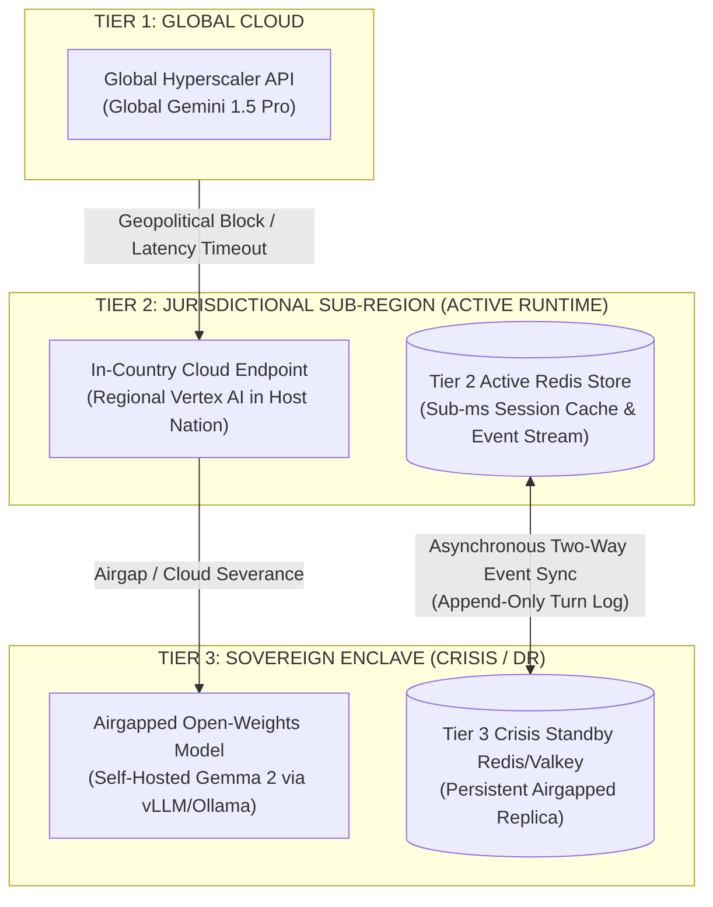
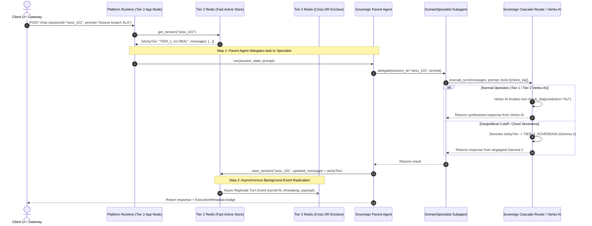
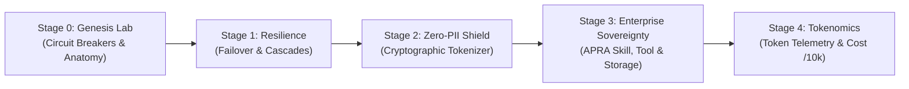

# Product Requirements Document (PRD)
## Project Sovereign-Stream: Universal Geopolitical AI Resilience & Autonomous Multi-Agent Framework

**Document Version:** 3.0.0  
**Author:** Sovereign-Stream Engineering Team  
**Status:** Approved Reference Specification  
**Scope:** Universal Sovereign AI Gateway, Vertex AI Tool Runtime & 3-Tier Replicating Redis Session Store  

---

## 1. Executive Summary & Problem Statement

Modern enterprise AI applications increasingly rely on global hyperscaler model APIs (such as Gemini 1.5 Pro). However, enterprises operating in sensitive or regulated jurisdictions face three major operational challenges:
1. **Geopolitical & Jurisdictional Lockouts:** Access to global AI models can be restricted, rate-limited, or blocked by sudden policy changes, cross-border embargoes, or jurisdictional mandates.
2. **Lack of Airgapped Continuity & Crisis Failover:** If external cloud model APIs are severed mid-conversation, most applications experience ungraceful HTTP 500 errors, lost conversation history, and complete operational failure.
3. **Developer Complexity in Multi-Agent State & Tooling:** Building multi-agent systems often forces developers to write complex boilerplate for session persistence, manual tool-schema parsing, memory isolation, and failover synchronization.

**Project Sovereign-Stream** solves this by providing:
* A **Platform Runtime & SDK** that makes agent development effortless—developers write only system prompts and standard typed Python tools.
* **Vertex AI Standardization** for robust reasoning, function calling, and standardized tool execution in Tiers 1 and 2.
* A **3-Tier Sovereign Cascade Router** coupled with a **Replicating Redis Session Store** that runs at sub-millisecond latency in Tier 2 while asynchronously performing **two-way event replication to Tier 3 (Sovereign Crisis/DR Enclave)** for zero-loss survival and resynchronization during real-world crises.

---

## 2. Universal 3-Tier Sovereign Hierarchy & Storage Replication

Sovereign-Stream abstracts both AI model execution and session state storage into three universal tiers:



1. **`TIER_1_GLOBAL` (Global Hyperscaler API):** The primary execution path during standard operations, offering the largest context windows and lowest cost/latency globally.
2. **`TIER_2_REGIONAL` (Jurisdictional Sub-Region & Primary Runtime):**
   * **Compute:** Pinned to cloud infrastructure physically residing within the customer's specific national boundary (e.g., Sydney `australia-southeast1`, Frankfurt, or US GovCloud) leveraging **Vertex AI** for standardized tool orchestration.
   * **Storage:** Houses the active **Tier 2 Redis Primary**, delivering `< 1ms` read/write latency for conversation context and agent scratchpads.
3. **`TIER_3_SOVEREIGN` (Local Sovereign Crisis Enclave):**
   * **Compute:** Self-hosted open-weights models (Gemma 2 9B/27B) running inside an isolated private VPC or on-premise infrastructure with zero external network dependencies.
   * **Storage:** Houses the **Tier 3 Standby Redis/Valkey** instance. During normal operations, Tier 2 asynchronously streams session updates to Tier 3. During a real-world crisis or cloud severance, Tier 3 takes over as the active read/write store and safely synchronizes new turns back to Tier 2 when connectivity resumes.

---

## 3. User Stories & Functional Requirements

### US-1: Universal Geopolitical Cascade & Sticky Demotion
* **As an enterprise operator**, I want the system to intercept any hyperscaler API failure, timeout, or geopolitical access restriction within 100ms and fail over to the next sovereign tier automatically.
* **Requirement 1.1:** The `SovereignCascadeRouter` must support configurable tier order: `TIER_1_GLOBAL` $\rightarrow$ `TIER_2_REGIONAL` $\rightarrow$ `TIER_3_SOVEREIGN`.
* **Requirement 1.2:** If an upper tier fails, the router must demote the session's `stickyTier` so subsequent user turns route directly to the healthy sovereign tier without repeating timeout penalties.

### US-2: Zero-Loss Context Preservation Across Failovers
* **As a user**, I want my active conversation to continue seamlessly when the system fails over from a global model to a local airgapped model without losing previous turns.
* **Requirement 2.1:** The router must maintain the entire conversation history using an **append-only turn event stream**, ensuring every turn has a unique timestamp and ID.
* **Requirement 2.2:** When cascading to `TIER_3_SOVEREIGN` (Gemma 2 / vLLM), the `schema_adapter` must translate message histories and tool outputs from hyperscaler formats to open chat-completion roles (`assistant`, `user`, `system`) on the fly.

### US-3: Pluggable Session Service & Two-Way Tier 2/Tier 3 Replication
* **As a resilience architect**, I want session state stored in Tier 2 for sub-millisecond latency while asynchronously replicating to Tier 3 so that an airgapped crisis node can take over instantly and resync when connectivity returns.
* **Requirement 3.1:** Provide a unified `SessionService` interface with implementations for:
  * `InMemorySessionService` (local prototyping/testing).
  * `RedisSessionService` (standalone Redis/Valkey).
  * `ReplicatingSessionService` (Tier 2 Primary with async background replication and two-way turn reconciliation to Tier 3).
* **Requirement 3.2:** Maintain two isolated data namespaces:
  * **Shared Transcript (`session:<session_id>`):** User/assistant messages, tool call transcripts, and routing state (`stickyTier`).
  * **Private Agent Memory (`private:<agent_name>:<session_id>`):** Agent-specific scratchpads and intermediate reasoning accessible only to that specific agent class.

### US-4: Standardized Tool Calling via Vertex AI & Declarative SDK
* **As an agent developer**, I want to define tools as standard typed Python functions so that the runtime and Vertex AI automatically validate schemas, execute function calls, and format results for the LLM.
* **Requirement 4.1:** The agent framework must support registering Python callables as tools (`tools=[get_account_balance, search_policy]`).
* **Requirement 4.2:** The runtime must automatically extract JSON schemas from function type hints and docstrings to pass to Vertex AI or local models, execute requested tool calls, and append tool results to the session history.

### US-5: Effortless Parent Agent & Subagent Delegation via `sessionId`
* **As an ADK developer**, I want a standardized base class (`SovereignResilientAgent`) capable of delegating scoped tasks to specialized subagents by passing only the `sessionId`.
* **Requirement 5.1:** The Parent Agent must provide `delegate(subagent, session_id, prompt)` without copying or duplicating conversation histories in memory.
* **Requirement 5.2:** Subagents invoked in the delegation chain must automatically inherit the session's active `stickyTier` and session store connection.

### US-6: Autonomous Sentinel Recovery
* **As an infrastructure engineer**, I want the system to continuously probe demoted upper tiers in the background and promote the session back to global/regional routing once outages lift.
* **Requirement 6.1:** The `RecoverySentinel` must execute out-of-band synthetic probes against demoted tiers without blocking active user traffic.
* **Requirement 6.2:** Promotion back to a higher tier requires meeting stability hysteresis criteria (2 consecutive successful probes under target SLA).

---

## 4. Developer Experience (DX): Building Autonomous Agents Effortlessly

A core design objective of Sovereign-Stream is **Developer Simplicity**. Developers should never write low-level Redis queries, failover retry loops, or manual JSON schema definitions.

### 4.1 The "10-Line Agent" Philosophy
Developers focus 100% on business logic: system instructions and typed Python tools. The Platform Runtime manages session hydration, replication, tool execution, and failover transparently.

```python
from src.adk.base_agent import SovereignResilientAgent

# 1. Define tools as standard type-annotated Python functions with docstrings
def check_breach_notification_sla(jurisdiction: str, breach_type: str) -> str:
    """Returns the mandatory breach reporting window for a jurisdiction."""
    if jurisdiction.upper() == "AU":
        return "APRA CPS 234 requires notification within 72 hours."
    return "Standard GDPR 72-hour notification applies."

# 2. Instantiate the agent with declarative tools
compliance_agent = SovereignResilientAgent(
    name="compliance_specialist",
    instruction="You are an expert regulatory compliance AI assistant.",
    tools=[check_breach_notification_sla],
)

# 3. Execute a turn (Runtime handles Redis hydration, tool execution & Tier failover)
async def handle_user_query(session_id: str, prompt: str):
    response = await compliance_agent.run(session_state={"session_id": session_id}, prompt=prompt)
    return response["content"]
```

### 4.2 Platform vs. Developer Responsibilities Matrix

| Capability | What the Developer Does | What the Platform Runtime Handles Automatically |
| :--- | :--- | :--- |
| **Session Hydration** | Passes `{"session_id": "user_123"}`. | Fetches conversation transcript and working scratchpads from Tier 2 Redis in `< 1ms`. |
| **Tool Orchestration** | Writes standard Python functions with type hints and docstrings. | Automatically formats schemas for Vertex AI / Gemini, intercepts tool call requests, executes the function, and injects results back into the conversation turn. |
| **State Persistence** | Calls `write_private_memory()` or returns from `run()`. | Automatically persists turn history and private memory to Tier 2 Redis and refreshes key TTLs. |
| **Crisis Replication** | Nothing. | Asynchronously streams append-only turn events to Tier 3 Redis in the background. If Tier 2 goes offline, Tier 3 takes over without losing data. |
| **Failover Routing** | Nothing (or sets optional `sovereignty_policy`). | Automatically cascades from Tier 1 (Global) to Tier 2 (Vertex AI Regional) to Tier 3 (Airgapped Gemma 2) on API error or geopolitical block. |
| **Multi-Agent Handoff** | Calls `await self.delegate(subagent, session_id, prompt)`. | Passes the session reference; the subagent reads shared history and inherits the active `stickyTier`. |

### 4.3 Declarative Tool Calling & Vertex AI Alignment
When running on Tier 1 (Global Gemini) or Tier 2 (Regional Vertex AI), the `SovereignCascadeRouter` maps Python tools into native Vertex AI / Gemini function declarations. If the model emits a function call:
1. The runtime intercepts the call and validates parameters.
2. Executes the developer's Python function.
3. Appends the tool execution event to the session transcript.
4. Performs a follow-up completion call to generate the final synthesized user answer.
5. In Tier 3 (Airgapped Gemma 2), the `schema_adapter` translates tool definitions into structured prompt instructions and parses tool invocation tokens seamlessly.

---

## 5. Multi-Agent Memory & Replicating Execution Architecture



---

## 6. Universal Policy Enums (`SovereigntyPolicy`)

To ensure global applicability across any customer or country, agent sovereignty policies are standardized into three universal modes:

```python
class SovereigntyPolicy(str, Enum):
    """Universal sovereignty routing constraint enforced on an agent."""
    GLOBAL_CASCADE = "GLOBAL_CASCADE"                      # Default 3-tier cascade (Tier 1 -> 2 -> 3)
    JURISDICTIONAL_OR_AIRGAP = "JURISDICTIONAL_OR_AIRGAP"  # Bypasses Global Tier 1, starts at Tier 2 (Vertex AI Regional)
    AU_SYD_REGIONAL_OR_AIRGAP = "AU_SYD_REGIONAL_OR_AIRGAP"# Alias for Australia Sydney residency
    STRICT_AIRGAP_VPC_ONLY = "STRICT_AIRGAP_VPC_ONLY"      # Locks exclusively to Tier 3 Airgapped Enclave
```

---

## 7. Acceptance Criteria & Verification Plan

| Test ID | Scenario | Expected Outcome | Verification Method |
| :--- | :--- | :--- | :--- |
| **AC-01** | Hyperscaler Tier 1 returns HTTP 403 / 404 (Simulated Geopolitical Lockout). | Instant failover to Tier 2/3 within <100ms; session `stickyTier` updated; zero conversation context lost. | Automated pytest in `tests/test_cascade_router.py`. |
| **AC-02** | Schema adaptation during Tier 3 failover to self-hosted Gemma 2. | All Gemini roles translated to `"assistant"`/`"user"`; system prompt prepended; valid JSON completion payload. | Automated pytest in `tests/test_schema_adapter.py`. |
| **AC-03** | Private memory isolation between `PolicyGuardAgent` and `DomainSpecialistAgent`. | Agent A's scratchpad (`private:policy_guard:...`) is inaccessible when Agent B reads shared session state. | Automated pytest in `tests/test_session_service.py`. |
| **AC-04** | Subagent delegation via `sessionId` across a multi-turn workflow. | Parent Agent delegates to subagent; subagent inherits active `stickyTier` and appends response cleanly. | Automated pytest in `tests/test_parent_agent.py`. |
| **AC-05** | Sentinel autonomous recovery after simulated outage resolves. | `RecoverySentinel` detects 2 consecutive healthy pings and promotes `stickyTier` back to primary tier. | Automated pytest in `tests/test_recovery_sentinel.py`. |
| **AC-06** | Declarative Tool Calling with automatic schema extraction and execution. | Developer passes Python function in `tools=[...]`; runtime executes tool and returns final synthesized response. | Automated pytest in `tests/test_tool_calling.py` (New). |
| **AC-07** | Tier 2 ↔ Tier 3 Asynchronous Replication and Two-Way Turn Resync. | Writes to `ReplicatingSessionService` persist immediately to Tier 2 and asynchronously mirror to Tier 3 without blocking. Upon reconnection, Tier 3 turns merge without data loss. | Automated pytest in `tests/test_replicating_session_service.py` (New). |

---

## 8. Progressive 5-Stage Governance Lifecycle & Interactive Robot Anatomy

To provide an intuitive, visual walkthrough of sovereign agent governance, Sovereign-Stream structures the end-to-end capabilities into 5 progressive stages:



1. **Stage 0 (Genesis Lab & Power-Up Sequence):** Dual industrial circuit breakers bring the cybernetic robot to life (Optics visor boot strobe + illuminated glass dome brain).
2. **Stage 1 (Resilience & Cascades):** Real-time multi-region failover and session persistence across Global, Regional, and Sovereign On-Prem nodes.
3. **Stage 2 (Zero-PII Shield):** Edge cryptographic tokenization replacing sensitive entities before model egress.
4. **Stage 3 (Enterprise Sovereignty):** Injecting APRA CPS 234 underwriter skills, deterministic LVR calculations, and sovereign storage at rest.
5. **Stage 4 (Tokenomics & Inference Economics):** Real-time token telemetry, Vertex AI rate card pricing, and 10,000-turn cost modeling.

