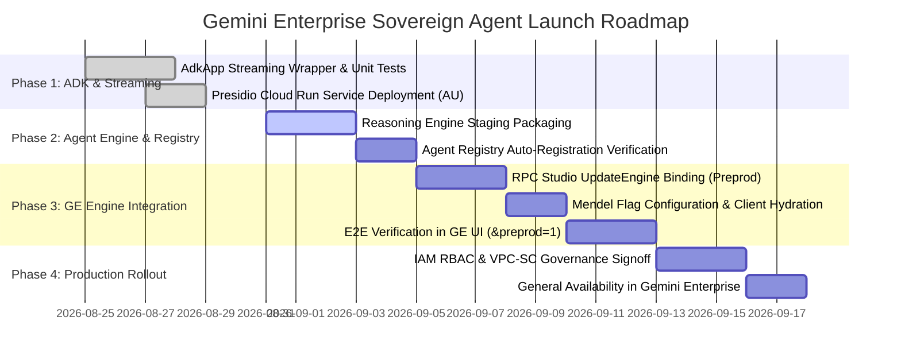

# Product Requirements Document (PRD)
## Gemini Enterprise (GE) Launch: Sovereign In-Region PII Pre-processor & A2A Fleet Agent

**Document Version:** 1.0.0  
**Target Release:** Gemini Enterprise Preprod / Prod (2026)  
**Author:** Sovereign-Stream Architecture & CE Team  
**Status:** Draft / Ready for Engineering Review  
**Target Compliance:** Australian Privacy Principle (APP 8), APRA CPS 234, Australian Government ISM, SOC 2 Type II  

---

## 1. Executive Summary

Modern enterprises in regulated industries (financial services, healthcare, public sector, and critical infrastructure) require the full conversational, multimodal, and agentic capabilities of **Gemini Enterprise (GE)** and **Google Workspace**. However, strict sovereign data residency mandates (such as Australia's **APP 8 Cross-Border Disclosure** and **APRA CPS 234**) prohibit sensitive Personally Identifiable Information (PII), customer identifiers, tax file numbers (TFNs), bank details, and vehicle telemetry from leaving sovereign national boundaries (e.g. Australia).

This PRD specifies the functional, technical, and operational requirements to launch the **Sovereign In-Region PII Pre-processor and Autonomous Fleet Agent** into **Gemini Enterprise (GE)** as a 1P Agent-to-Agent (A2A) registered agent.

By packaging our in-region Presidio tokenization engine on Google Cloud Run (`australia-southeast1`), enterprise grounding interceptors (Google Drive and Google Sheets / Trix), and resilient cascade routing into a managed **Vertex AI Agent Engine (AdkApp)**, this solution enables enterprise users to interact with sovereign agents directly inside Gemini Enterprise chat and Workspace sidebars with **100% verified zero raw PII egress**.

---

## 2. Problem Statement & Business Opportunity

1. **Sovereignty vs. Hyperscaler AI Paradox:** Regulated enterprise clients are blocked from adopting Gemini Enterprise if prompts containing local PII transit to global/US model regions without in-region anonymization.
2. **Streaming & Agent-to-Agent Compatibility:** To be accessible inside Gemini Enterprise and conversational interfaces, agents must support real-time token streaming (`stream_query` via generator protocols) and declare machine-readable A2A Agent Cards.
3. **Enterprise RAG Data Leakage:** Grounding queries against enterprise repositories (Google Drive, Trix) often pull un-sanitized customer records into LLM context windows, triggering compliance violations.
4. **Access Control & Discoverability:** Enterprise administrators need granular role-based access control (RBAC) so that only authorized employee groups (e.g., claims investigators, HR specialists) can discover and invoke sensitive domain agents inside GE.

---

## 3. Personas & User Journeys

| Persona | Role | Primary Goal | Experience in Gemini Enterprise |
| :--- | :--- | :--- | :--- |
| **Sarah (Claims Investigator)** | End User | Investigate vehicle accident claims and cross-reference policyholder documents. | Types natural prompts (e.g., *"Review policy for John Doe, plate NSW-ABC123"*). Receives streamed, cleartext answers with grounded Drive/Sheets citations. Completely unaware that PII was tokenized over the wire. |
| **David (Chief Information Security Officer)** | Compliance / Risk | Guarantee zero PII egresses beyond Australian legal jurisdiction. | Audits Cloud Run tokenization logs, VPC-SC boundaries, and KMS key usage, confirming 100% APP 8 compliance. |
| **Elena (Enterprise Workspace Admin)** | IT Admin | Provision and govern agent availability across departments. | Binds the agent to the company's Gemini Enterprise Engine via Discovery Engine RPCs and restricts invocation to specific Google Groups. |
| **Marcus (Agent Developer)** | Engineer | Build downstream specialist agents with automated sovereignty. | Subclasses `SovereignResilientAgent`, registers tools, and deploys using `AdkApp` without writing tokenization or streaming boilerplate. |

---

## 4. Functional Requirements

### 4.1 Feature Set 1: ADK Streaming Runtime & AdkApp Generator
* **FR-1.1:** The agent runtime MUST implement a subclass of `vertexai.preview.reasoning_engines.AdkApp`.
* **FR-1.2:** The `AdkApp` wrapper MUST expose both `query(*args, **kwargs)` for batch invocation and `stream_query(*args, **kwargs)` using standard Python `yield` / `yield from` generator semantics to support Gemini Enterprise token-by-token streaming.
* **FR-1.3:** The wrapper MUST seamlessly preserve session context (`sessionId`), token vaults, and grounding metadata across streaming chunks.

### 4.2 Feature Set 2: In-Region PII Tokenization & De-tokenization Pipeline
* **FR-2.1:** All inbound user prompts and outbound model generations MUST be intercepted by the Sovereign PII Tokenizer running in `australia-southeast1`.
* **FR-2.2:** The tokenizer MUST detect and tokenize entities including `PERSON`, `EMAIL_ADDRESS`, `PHONE_NUMBER`, `AU_TFN`, `AU_MEDICARE`, `AU_BSB`, and `AU_LICENSE_PLATE`.
* **FR-2.3:** Tokenization overhead MUST NOT exceed 50ms per turn at $p95$.
* **FR-2.4:** Regex protection MUST prevent false-positive masking on enterprise financial and domain acronyms (`AUD`, `BSB`, `TFN`, `VIN`).
* **FR-2.5:** Ephemeral surrogate mappings MUST be stored in an in-region encrypted vault with automated session TTL.

### 4.3 Feature Set 3: Sovereign Grounding Interceptors (Google Drive & Trix)
* **FR-3.1:** The agent MUST support declarative enterprise grounding tools (`search_enterprise_knowledge`).
* **FR-3.2:** Retrieved context from Google Drive (`GDriveConnector`) and Google Sheets (`TrixConnector`) MUST be sanitized in-region by `SovereignGroundingInterceptor` before injection into the LLM context window.
* **FR-3.3:** The agent MUST return source attribution metadata (file names, document IDs, sheet ranges) while keeping PII redacted during inference.

### 4.4 Feature Set 4: Managed Vertex AI Agent Engine Deployment
* **FR-4.1:** The agent package MUST be deployable to Vertex AI Agent Engine (Reasoning Engine) via `ReasoningEngine.create()`.
* **FR-4.2:** Container dependencies (`google-cloud-aiplatform[agent_engines,adk]`, `presidio-analyzer`, `presidio-anonymizer`, `spacy`, `pydantic`) MUST be packaged and staged hermetically in Cloud Storage.
* **FR-4.3:** The deployment MUST expose health check probes and runtime telemetry.

### 4.5 Feature Set 5: Agent Registry Auto-Registration (A2A Protocol)
* **FR-5.1:** Deployment via `AdkApp` MUST automatically publish an A2A Agent Card in the Google Cloud Agent Registry (`gcloud alpha agent-registry`).
* **FR-5.2:** The Agent Card MUST declare agent skills, input/output schemas, authorization scopes, and endpoint URLs.
* **FR-5.3:** Registrations MUST be discoverable in the Pantheon Agent Registry console.

### 4.6 Feature Set 6: Gemini Enterprise (GE) Engine Binding
* **FR-6.1:** The agent MUST be bindable to Gemini Enterprise (Discovery Engine / Vertex AI Search & Conversation) via `CreateAgent` and `UpdateEngine` APIs.
* **FR-6.2:** The assistant configuration MUST route domain intents to the registered Sovereign Agent Gateway.
* **FR-6.3:** End User Credentials and Data Access Reasons MUST be supported for auditing and compliance tracking.

### 4.7 Feature Set 7: Client Hydration & Workspace Integration
* **FR-7.1:** The agent MUST be accessible via the Gemini Enterprise web interface (`pantheon-staging.corp.google.com` or production GE).
* **FR-7.2:** Client-side hydration MUST support Mendel flags for `@` mention discovery and side-by-side workspace collaboration.

### 4.8 Feature Set 8: Enterprise Security, RBAC & VPC-SC Governance
* **FR-8.1:** Reasoning Engine invocation MUST be protected by IAM RBAC (`roles/aiplatform.user`) scoped to designated enterprise Google Groups.
* **FR-8.2:** Gemini Enterprise Agent Sharing settings MUST enforce group-level visibility.
* **FR-8.3:** All compute and storage assets MUST reside within a VPC Service Controls perimeter with CMEK encryption via Cloud KMS in Sydney.

---

## 5. Non-Functional Requirements (NFRs)

| Category | Metric / Requirement | Target SLA |
| :--- | :--- | :--- |
| **Latency** | In-region PII tokenization & vault latency | $< 50\text{ms}$ ($p95$) |
| **Streaming Latency** | Time to First Token (TTFT) in GE UI | $< 1200\text{ms}$ |
| **Availability** | Multi-tier sovereign cascade uptime | $\ge 99.95\%$ |
| **Data Residency** | Un-tokenized PII egress outside Australia | **$0.00\%$ (Zero-Tolerance)** |
| **Concurrency** | Simultaneous active sessions per instance | $\ge 500$ concurrent sessions |
| **Security** | At-rest and in-transit encryption | TLS 1.3 + AES-256 CMEK |

---

## 6. Success Metrics & Key Performance Indicators (KPIs)

1. **Zero-PII Compliance Rate:** $100\%$ of outgoing requests verified clear of raw PII via synthetic canary testing.
2. **User Task Completion Rate:** $\ge 92\%$ successful resolution of fleet/claims queries in Gemini Enterprise.
3. **Turnaround Overhead:** Preprocessing + grounding latency adds $< 100\text{ms}$ to end-to-end LLM response generation.
4. **Adoption & Engagement:** $\ge 80\%$ positive user rating on response clarity and transparent de-tokenization.

---

## 7. Phased Release Roadmap

