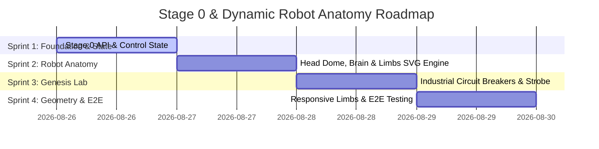

# Implementation Plan: Stage 0 Genesis Lab & Cybernetic Robot Anatomy

**Document Version:** 1.0.0  
**Target Branch:** `feature/stage-zero-demo`  
**Execution Methodology:** Sprint-Based Phased Rollout  

---

## 1. Executive Summary

This implementation plan defines the step-by-step roadmap for introducing **Stage 0 (Agent Genesis / Power-Up Sequence)** and dynamic cybernetic robot anatomy into Project Sovereign-Stream. 

The implementation is structured across **4 targeted sprints**:
* **Sprint 1:** State Machine, Backend API & Stage 0 Preset Alignment
* **Sprint 2:** Cybernetic Robot Anatomy (Glass Dome, Pulsing Brain, Articulated Arms, Hydraulic Legs)
* **Sprint 3:** Stage 0 Interactive Genesis Lab (Old-School Circuit Breakers & Strobe Sequencer)
* **Sprint 4:** Multi-Stage Stance Geometry, End-to-End Testing & Documentation Wrap

---

## 2. Sprint Breakdown & Goal Deliverables

---

### Sprint 1: State Machine & API Alignment
**Primary Goal:** Establish Stage 0 control state, reset endpoints, and UI preset buttons across the application.

* **Tasks:**
  1. Update `SimulationControls` in `src/frontend/src/types.ts` and `src/backend/main.py`:
     - Add `stageZeroRuntimeEnabled: boolean` (Default `false` in Stage 0).
     - Add `stageZeroIntelligenceEnabled: boolean` (Default `false` in Stage 0).
  2. Update `/api/settings` and `/api/demo/reset` in `src/backend/main.py` to handle `stage: 0` resets cleanly.
  3. Update preset selector pills in `index.html` and `ChaosPanel.tsx` to include `0: Genesis` along with `1: Failover`, `2: PII Shield`, `3: Enterprise`, and `4: Tokenomics`.
  4. Write unit tests in `tests/test_api_gateway.py` verifying Stage 0 settings serialization and reset idempotency.

* **Deliverables:**
  - ✅ Typed state interfaces supporting Stage 0 breakers.
  - ✅ API reset supporting `stage === 0`.
  - ✅ 5-stage preset button ribbon (`Stage 0` to `Stage 4`).

---

### Sprint 2: Cybernetic Robot Anatomy (Dome, Brain & Limbs)
**Primary Goal:** Build the visual anatomy surrounding the Sovereign Agent Specs card in the sidebar.

* **Tasks:**
  1. **The Glass Dome & Brain Headpiece (`RobotHead.tsx` / SVG generator):**
     - Glass dome with reflection curvature (`backdrop-blur-sm`, glass highlights).
     - Synaptic neural brain SVG that pulses with active tier color (`#3b82f6` Global, `#f59e0b` Regional, `#10b981` Sovereign).
     - Eyepiece visor with animated LED ocular pupils and bootup strobe support (`@keyframes visorStrobe`).
  2. **Articulated Mechanical Arms (`RobotArms.tsx` / SVG generator):**
     - Left and right shoulder ball joints attached to upper chassis.
     - Dual-segment mechanical arm with forearm conduits and status LEDs.
  3. **Hydraulic Suspension Legs (`RobotLegs.tsx` / SVG generator):**
     - Piston cylinders and reinforced foot pads mounted beneath the chassis.
  4. **Sidebar Container Adjustment:**
     - Expand sidebar width from `w-[340px]` to `w-[390px]` to provide adequate limb clearance.

* **Deliverables:**
  - ✅ Interactive robot head with dome and brain.
  - ✅ Left/right mechanical arms framing the torso chassis.
  - ✅ Hydraulic leg baseplate anchoring the specs card.

---

### Sprint 3: Stage 0 Genesis Lab & Circuit Breakers
**Primary Goal:** Replace the chat window during Stage 0 with an interactive industrial switchboard that brings the robot to life.

* **Tasks:**
  1. **Industrial Circuit Breaker Component (`CircuitBreaker.tsx` / HTML template):**
     - Heavy-duty knife-throw lever with mechanical throw animation.
     - Red `OFF` / Green `ENERGIZED` status pilot lights.
     - Voltage/Load readouts (`0V STANDBY` $\rightarrow$ `240V ONLINE`).
     - Hazard stripe accents and knurled metallic plates.
  2. **Breaker #1 Interaction (Execution Runtime):**
     - ON: Visor eyes blink 4 times rapidly in strobe pattern, then lock to steady illumination; `⚙️ Runtime` row appears in torso.
     - OFF: Eyes power down to dark state; `⚙️ Runtime` row collapses.
  3. **Breaker #2 Interaction (Cognitive Intelligence):**
     - ON: Glass dome lights up; glowing synaptic brain appears; `📍 Model Location` and `⚡ Model` appear in torso.
     - OFF: Brain vanishes from dome; Model and Location rows collapse.
  4. **Direct Playground / Latency Prober:**
     - Optional live prompt tester available once both breakers are engaged.

* **Deliverables:**
  - ✅ Full-screen Genesis Lab view for Stage 0.
  - ✅ Functional reversible circuit breakers for Runtime and Intelligence.
  - ✅ Synchronized eye strobe and brain illumination triggers.

---

### Sprint 4: Dynamic Stance Geometry & Test Verification
**Primary Goal:** Seamless auto-scaling of limbs across all stages (0 to 4) and comprehensive test suite validation.

* **Tasks:**
  1. **Dynamic Stance & Limbs Auto-Scaling:**
     - Measure torso element count dynamically (`3` elements in Stage 0 $\rightarrow$ `10` elements in Stage 4).
     - Calculate leg suspension compression and arm piston angles so the robot maintains balanced visual proportions as the body expands.
  2. **FastAPI Standalone Synchronization:**
     - Synchronize complete visual anatomy and circuit breaker logic into `src/backend/static/index.html`.
  3. **Verification & Test Suite:**
     - Run `pytest` to ensure 100% test pass rate across all 111+ unit/integration tests.
     - Test live browser rendering and UI transitions across Stages 0, 1, 2, 3, 4.

* **Deliverables:**
  - ✅ Limbs adjust dynamically across all 5 demo stages.
  - ✅ Full parity between standalone `index.html` and modular React components.
  - ✅ All tests passing cleanly.

---

## 3. Risk Mitigation & Quality Criteria

| Potential Risk | Impact | Mitigation Strategy |
| :--- | :--- | :--- |
| **Sidebar Vertical Overflow on Smaller Screens** | High | Use flexible container scaling and smooth scrolling inside sidebar with auto-compressing leg hydraulics. |
| **Stage 0 Direct Navigation Friction** | Medium | When user jumps directly from Stage 0 to Stages 1–4, auto-engage both breakers so the chat stream functions immediately. |
| **SVG Visual Layout Shift** | Low | Anchor arm and leg SVGs with `absolute` positioning relative to the main torso card bounding box. |
