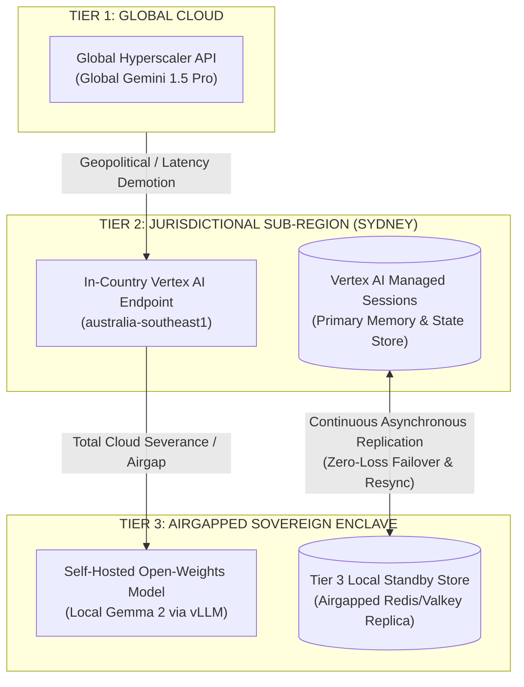

# Project Sovereign-Stream: The Sovereign Resilient Agent
**Technical Architecture & Executive Pitch: Out-of-the-Box ADK, Vertex AI Managed Memory & Local Failover**

* **Document Version:** 2.0.0 (Agent-Centric Focus)*  
* **Target Audience:** Engineering Leadership, Principal Architects, Cloud AI & Platform Teams*  
* **Core Technology Stack:** Google ADK (Agent Development Kit), Vertex AI Agent Engine, Gemma 2*  

---

## 1. Executive Summary: The Agent-Centric Pitch

### The 60-Second Pitch
> *"When building enterprise AI agents, teams are often forced into a false choice: either build on powerful managed cloud platforms and risk total outage during network or geopolitical failures, or build complex custom infrastructure from scratch.*  
>  
> ***Project Sovereign-Stream** introduces a resilient enterprise agent built **100% on out-of-the-box Google ADK and Vertex AI** for Tiers 1 and 2, paired with a **simple fallback architecture for Tier 3**.  
>  
> The agent's **'short-term memory'**—its conversation history, active context window, and tool outputs—is managed natively by **Vertex AI** during normal operations. In the event of a cloud failure or severance, that memory **safely fails over to local storage**. Whether the agent calls a **Global** model (Gemini 1.5 Pro), a **Regional** model (Sydney Vertex AI Gemini), or a **Local** airgapped model (Gemma 2), **it always operates with the exact same memory and context**. Zero lost turns, zero conversation restarts, and zero custom orchestration boilerplate."*

---

## 2. The Core Architecture Matrix & Key Takeaways

### The Sovereign Architecture Matrix
Below is the definitive breakdown of where agent orchestration compute runs, where model inference happens, and where session memory (context window & scratchpad) is persisted for each tier:

| Tier | Agent Orchestration Runtime | AI Model Inference Location | Session & Memory Store (Context Window & Scratchpad) |
| :--- | :--- | :--- | :--- |
| **Tier 1 (Global)** | Vertex AI Agent Engine (`australia-southeast1`) | **Global Hyperscaler API** (`generativelanguage.googleapis.com`) | **Vertex AI Managed Sessions** in Tier 2 (`australia-southeast1`) |
| **Tier 2 (Regional)** | Vertex AI Agent Engine (`australia-southeast1`) | **In-Country Vertex AI** (`australia-southeast1`) | **Vertex AI Managed Sessions** in Tier 2 (`australia-southeast1`) |
| **Tier 3 (Airgap VPC)** | Private Isolated VPC / On-Prem Enclave | **Self-Hosted Gemma 2** (Private VPC vLLM / Ollama) | **Tier 3 Local Standby Store** (Airgapped Redis/Valkey Replica) |



### Key Architectural Takeaways
1. **One Governed Cloud Memory Layer (Tiers 1 & 2):**
   * Whether the agent executes a turn using Global Gemini (Tier 1) or Regional Sydney Vertex AI (Tier 2), it **always** reads and writes the full conversation transcript, context window, and agent private memory from/to **Vertex AI Managed Sessions in Sydney (`australia-southeast1`)**.
2. **Zero Egress for Data at Rest:**
   * Even when taking advantage of global hyperscaler throughput for Tier 1 inference speed, all session memory at rest is strictly governed under Australian data residency (APRA CPS 234 / ISM compliance).
3. **Airgap Resiliency (Tier 3 Local Standby):**
   * An airgapped or disconnected environment cannot reach cloud managed sessions during an outage. Therefore, the **Tier 3 Local Standby Store (Redis/Valkey)** continuously mirrors the Vertex AI Managed Sessions stream. If external cloud connectivity is severed, the enclave promotes its local replica immediately with zero lost turns.
4. **Context Invariance Across Models:**
   * Because memory is decoupled from inference, a conversation started on Global Gemini can fail over to Regional Vertex AI or Local Gemma 2 mid-thought without dropping a single token or restarting the session.

### 4. Simple Architecture for Tier 3
* Rather than weighing down the application with heavy distributed systems for offline mode, **Tier 3 uses a simple, lightweight architecture**:
  * Local inference via **Gemma 2** (Ollama/vLLM).
  * On-the-fly schema adaptation so standard ADK tools work seamlessly on local open-weights models.
  * Local persistence that resynchronizes with Vertex AI when cloud connectivity is restored.

---

## 3. How the Agent Works: Turn Execution Lifecycle

1. **Session Hydration:**  
   When a user sends a prompt with `sessionId`, the agent hydrates its short-term memory. In normal conditions, this is pulled directly from Vertex AI Managed Sessions. If offline, it reads from the local fallback store.
2. **Model Tier Selection:**  
   The agent checks policy and health, selecting either Global Gemini (Tier 1), Regional AU Vertex AI (Tier 2), or Local Gemma 2 (Tier 3).
3. **Execution with Unified Context:**  
   The agent passes the exact same short-term memory context window to the selected model. If tool calls are requested, the agent executes standard Python functions and appends results to memory.
4. **State Persistence & Safety:**  
   The assistant's response is appended to the short-term memory. In Tiers 1/2, Vertex AI persists the turn. In Tier 3, it persists locally with guaranteed consistency.

---

## 4. The Developer Experience: Pure Business Logic

Developers build on standard Google ADK patterns without writing any failover loops, custom Redis synchronization, or model-switching logic:

```python
from src.adk.base_agent import SovereignResilientAgent

# 1. Define standard typed Python tools with docstrings
def verify_apra_breach_sla(jurisdiction: str) -> str:
    """Returns mandatory regulatory breach notification SLA for a jurisdiction."""
    if jurisdiction.upper() == "AU":
        return "APRA CPS 234 requires notification to APRA within 72 hours."
    return "Standard 72-hour notification applies."

# 2. Instantiate the agent using out-of-the-box ADK & Vertex AI
compliance_agent = SovereignResilientAgent(
    name="compliance_sentinel",
    instruction="You are an expert Australian banking compliance AI.",
    tools=[verify_apra_breach_sla],
    # Short-term memory is managed by Vertex AI in Tiers 1 & 2,
    # safely failing over to local storage in Tier 3 on outage.
)

# 3. Execute: Call Global, Regional, or Local models with the EXACT SAME memory
async def handle_turn(session_id: str, user_prompt: str):
    response = await compliance_agent.run(
        session_state={"session_id": session_id},
        prompt=user_prompt
    )
    return response["content"]
```

---

## 5. Summary Matrix: Why Technical Teams Choose This Pattern

| Architectural Dimension | Traditional Enterprise AI | The Sovereign Resilient Agent |
| :--- | :--- | :--- |
| **Framework & Tooling** | Custom wrappers, ad-hoc orchestration, fragile middleware. | **100% Out-of-the-Box Google ADK & Vertex AI** for Tiers 1 and 2. |
| **Short-Term Memory** | Lost on provider switch or HTTP 500 error; conversation resets. | **Managed by Vertex AI**; safely fails over to local storage during outages. |
| **Model Flexibility** | Hardcoded to one provider/endpoint; breaks if endpoint is blocked. | **Call Global, Regional, or Local** models dynamically on any turn. |
| **Memory Consistency** | Context fragments when switching between cloud and fallback models. | **Exact Same Memory** available to every model tier without exception. |
| **Tier 3 (Airgap Fallback)** | Over-engineered, separate codebase or non-existent. | **Simple local architecture** (Gemma 2 + local store) sharing the ADK contract. |
