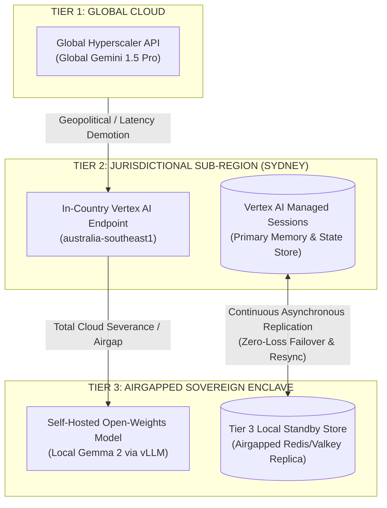
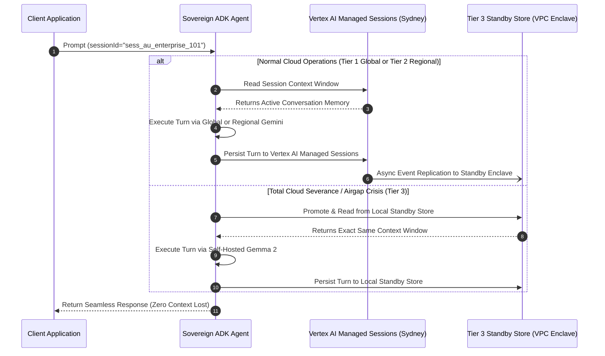
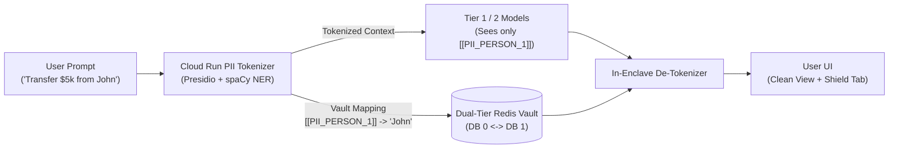

# Project Sovereign-Stream: The Sovereign Resilient Agent
**Technical Pitch Deck: Vertex AI Managed Memory, The Architectural Matrix & Safe Local Fallback**

* **Presenter:** Sovereign-Stream Engineering Team  
* **Format:** Technical Presentation & Slide Deck with Speaker Notes  
* **Target Audience:** Engineering Leadership, Principal Architects, Cloud AI & Platform Engineers  

---

## Slide 1: Title & Core Value Proposition
### The Sovereign Resilient Agent: Unstoppable AI Built on Google ADK & Vertex AI

* **The Breakthrough:** A production-grade enterprise multi-tier agent that decouples model inference from memory continuity.
* **Three Agent Pillars:**
  1. **Out-of-the-Box ADK & Vertex AI:** Built 100% on standard Google ADK and Vertex AI Agent Engine for Tier 1 (Global) and Tier 2 (Regional).
  2. **Governed In-Country Memory:** The agent's session memory is hosted by **Vertex AI Managed Sessions in Sydney (`australia-southeast1`)** for both Global and Regional models—and **safely replicates to an airgapped local standby store** for zero-loss survival.
  3. **Universal Model Calling:** The agent can invoke **Global**, **Regional**, or **Local** models on any turn and always share the **exact same memory and context window**.

> **Speaker Note:**  
> *"Good morning, team. Today we are presenting the architecture of our Sovereign Resilient Agent. When building enterprise AI under strict data residency like APRA CPS 234, teams often assume they cannot use global frontier models. We're demonstrating an agent where session memory and state are strictly anchored in Sydney using Vertex AI Managed Sessions for both Global and Regional models. If a cloud severance occurs, that memory safely fails over to an airgapped local standby store."*

---

## Slide 2: The Core Architectural Matrix
### Where the Agent Runs, Where Inference Happens, and Where Memory Lives

| Tier | Agent Orchestration Runtime | AI Model Inference Location | Session & Memory Store (Context Window & Scratchpad) |
| :--- | :--- | :--- | :--- |
| **Tier 1 (Global)** | Vertex AI Agent Engine (`australia-southeast1`) | **Global Hyperscaler API** (`generativelanguage.googleapis.com`) | **Vertex AI Managed Sessions** in Tier 2 (`australia-southeast1`) |
| **Tier 2 (Regional)** | Vertex AI Agent Engine (`australia-southeast1`) | **In-Country Vertex AI** (`australia-southeast1`) | **Vertex AI Managed Sessions** in Tier 2 (`australia-southeast1`) |
| **Tier 3 (Airgap VPC)** | Private Isolated VPC / On-Prem Enclave | **Self-Hosted Gemma 2** (Private VPC vLLM / Ollama) | **Tier 3 Local Standby Store** (Airgapped Redis/Valkey Replica) |



> **Speaker Note:**  
> *"This matrix is the centerpiece of our architecture. Notice the separation of concerns across the three columns. For both Tier 1 Global and Tier 2 Regional, the orchestration runtime and the authoritative session memory live in Sydney (`australia-southeast1`) inside Vertex AI Managed Sessions. Only the inference computation shifts between the Global Gemini API and the Sydney Vertex AI endpoint."*

---

## Slide 3: Key Architectural Takeaways
### Why This Architecture Wins for Enterprise & Sovereign AI

1. **One Governed Cloud Memory Layer (Tiers 1 & 2):**
   * Whether the agent executes a turn using Global Gemini (Tier 1) or Regional Sydney Vertex AI (Tier 2), it **always** reads and writes the full conversation transcript, context window, and agent private memory from/to **Vertex AI Managed Sessions in Sydney (`australia-southeast1`)**.
2. **Zero Egress for Data at Rest:**
   * Even when taking advantage of global hyperscaler throughput for Tier 1 inference speed, all session memory at rest is strictly governed under Australian data residency (APRA CPS 234 / ISM compliance).
3. **Airgap Resiliency (Tier 3 Local Standby):**
   * An airgapped or disconnected environment cannot reach cloud managed sessions during an outage. Therefore, the **Tier 3 Local Standby Store (Redis/Valkey)** continuously mirrors the Vertex AI Managed Sessions stream. If external cloud connectivity is severed, the enclave promotes its local replica immediately with zero lost turns.
4. **Context Invariance Across Models:**
   * Because memory is decoupled from inference, a conversation started on Global Gemini can fail over to Regional Vertex AI or Local Gemma 2 mid-thought without dropping a single token or restarting the session.

> **Speaker Note:**  
> *"Let's emphasize these four key takeaways. First: one governed memory layer in Sydney for both Tier 1 and Tier 2. Second: zero egress for data at rest. Third: true airgap resiliency via our Tier 3 local standby store. And fourth: complete context invariance across any model."*

---

## Slide 4: Failover-Safe Session Lifecycle
### Seamless Transition from Vertex AI Managed Sessions to Local Standby



* **Live Replication:** During normal operations, Vertex AI Managed Sessions in Sydney asynchronously streams turn updates to the local standby store.
* **Instant Promotion:** On cloud severance, the agent reads directly from the Tier 3 Standby Store.
* **Two-Way Reconciliation:** When cloud connectivity returns, the local standby store safely synchronizes new turns back to Vertex AI Managed Sessions.

> **Speaker Note:**  
> *"Here is the sequence diagram showing how our memory layer behaves during a crisis. During normal operations, every turn is written to Vertex AI Managed Sessions in Sydney and asynchronously replicated to the standby enclave. If the cloud is severed, the agent promotes the local standby store and continues with zero context loss."*

---

## Slide 5: Code Walkthrough — Building with Out-of-the-Box ADK
### Standard Python Tools & Declarative Agents

```python
from src.adk.base_agent import SovereignResilientAgent

# 1. Define standard typed Python tools with docstrings
def verify_apra_breach_sla(jurisdiction: str) -> str:
    """Returns mandatory regulatory breach notification SLA for a jurisdiction."""
    if jurisdiction.upper() == "AU":
        return "APRA CPS 234 requires notification to APRA within 72 hours."
    return "Standard 72-hour notification applies."

# 2. Instantiate agent using out-of-the-box Google ADK
compliance_agent = SovereignResilientAgent(
    name="compliance_sentinel",
    instruction="You are an expert Australian banking compliance AI.",
    tools=[verify_apra_breach_sla],
    # Authoritative memory is stored in Vertex AI Managed Sessions (AU-SYD)
    # for Tiers 1 & 2, with async replication to the Tier 3 standby store.
)

# 3. Execute: Call Global, Regional, or Local models with the SAME memory
async def handle_turn(session_id: str, user_prompt: str):
    response = await compliance_agent.run(
        session_state={"session_id": session_id},
        prompt=user_prompt
    )
    return response["content"]
```

* **Zero Infrastructure Clutter:** No custom memory synchronization loops or provider retry switches in agent business logic.
* **Guaranteed Memory Invariance:** Pass `session_id` and the agent accesses the exact same context across any tier.

> **Speaker Note:**  
> *"Look at the developer experience. This is standard Google ADK Python code. Developers write system prompts and typed tools. The platform runtime handles the routing between Global Gemini, Sydney Vertex AI, and Local Gemma 2 while anchoring state in Vertex AI Managed Sessions."*

---

## Slide 6: Privacy Extension: Zero-PII Tokenizer & Parallel Context Windows
### Provable Zero-PII Egress to Global Frontier Models with Deterministic Vaulting



* **Zero-PII Invariance:** External models (Gemini 1.5 Pro / Flash) physically never receive real customer names, account numbers, or national identifiers.
* **Parallel Context Window:** Synchronizes canonical cleartext context with an anonymized model context.
* **High-Entropy Resilient Tokens:** `[[PII_PERSON_1_7A]]` format eliminates collisions, and resilient fuzzy regex heals any LLM bracket/casing drift.
* **100% Modular & Feature-Toggled:** Bypasses without overhead when disabled.

> **Speaker Note:**  
> *"Slide 6 introduces our Privacy & Data Minimization extension. When operating in Tier 1 with Global Gemini, sensitive customer PII is tokenized inside our Sydney boundary using a lightweight Presidio container on Cloud Run. The model reasons over high-entropy tokens like `[[PII_PERSON_1_7A]]`, and the response is reassembled in-enclave before the user sees it. Compliance teams can view the exact tokenized context window live in the UI's Sovereign Shield tab."*

---

## Slide 7: Summary & Live Demo Transition
### Sovereign-Stream: Enterprise Resilience & Privacy Without Compromise

1. **Centerpiece Architecture:**  
   The 3-Tier Summary Matrix guarantees that data at rest stays in Sydney (`australia-southeast1`) across both Global and Regional model execution.
2. **Key Architectural Takeaways:**  
   * One Governed Cloud Memory Layer (Vertex AI Managed Sessions).
   * Zero Egress for Data at Rest & Zero PII Egress to Frontier Models.
   * True Airgap Resiliency via Local Standby Replication.
   * Context Invariance across Gemini 1.5 Pro, Regional Vertex AI, and Gemma 2.

### Thank You & Open Q&A
* *Live Demo / Interactive Chaos Testing with real-time Architecture Matrix available in the Sovereign-Stream UI.*

