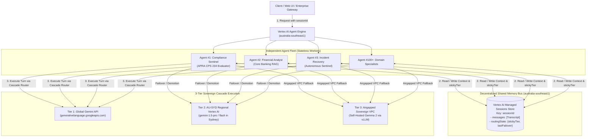
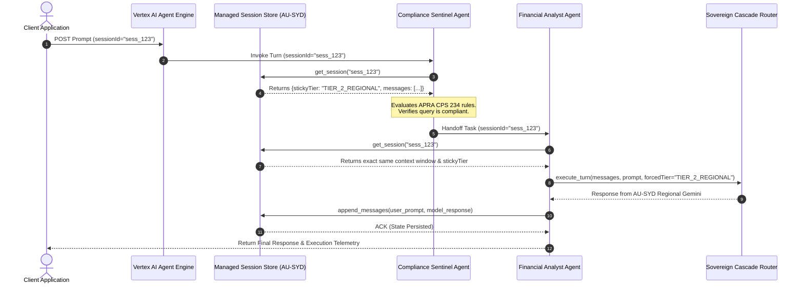

# Project Sovereign-Stream: Enterprise Multi-Agent Architecture
## Decentralized Autonomous Agents with Vertex AI Agent Engine Managed Sessions

**Author:** Project Sovereign-Stream Architecture Team  
**Date:** August 2026  
**Status:** Architecture Design Document / Reference Specification  
**Compliance Target:** APRA CPS 234 / Australian Government ISM / AU Data Residency  

---

## 1. Executive Summary

In the initial proof-of-concept for **Project Sovereign-Stream**, session state and conversation transcripts were stored in an in-memory dictionary (`SESSION_STORE`) within a monolithic FastAPI backend gateway. While effective for single-server demonstrations, this pattern creates a tight coupling between agent compute and state storage.

This document outlines the production enterprise architecture for scaling **Sovereign-Stream** to support **hundreds of independent, specialized agents** running autonomously on **Google Cloud Vertex AI Agent Engine (Reasoning Engine)** without a centralized application server. 

By leveraging **Vertex AI Agent Engine Managed Sessions** pinned to the **Sydney region (`australia-southeast1`)**, agents operate as completely stateless workers that coordinate, share context windows, and enforce 3-tier sovereign failover policies over a unified, compliant shared memory bus.

---

## 2. High-Level Architecture

In this decentralized architecture, there is no central orchestrator or monolith web application. Independent agents are deployed as distinct Vertex AI Agent Engine endpoints. All state—including conversation history (the context window) and real-time sovereign routing metadata (`stickyTier`)—is externalized into **Vertex AI Managed Sessions**.



---

## 3. Core Architectural Pillars

### 3.1 The Shared Memory Bus: Vertex AI Managed Sessions
Rather than passing multi-kilobyte message histories between services, the **`sessionId`** acts as a universal reference token across the entire enterprise agent ecosystem.

* **Stateless Compute:** Agents hold zero memory in RAM between turns. Any container or Agent Engine instance can service any request.
* **ACID Consistency:** When an agent updates the conversation transcript or demotes the session to `TIER_2_REGIONAL`, the change is immediately committed and visible to all other agents in the fleet.
* **Zero Infrastructure Overhead:** Google Cloud manages session storage replication, scaling, and encryption transparently within the designated region.

### 3.2 The Enterprise Session Schema
Each session document in Vertex AI Managed Sessions maintains both the conversational context window and operational sovereignty telemetry:

```json
{
  "sessionId": "sess_au_enterprise_88219",
  "tenantId": "org_retail_banking_au",
  "dataResidencyRegion": "australia-southeast1",
  "complianceClassification": "OFFICIAL:Sensitive",
  "routingState": {
    "stickyTier": "TIER_2_REGIONAL",
    "lastDemotionTimestamp": "2026-08-19T10:45:00Z",
    "consecutiveFailuresT1": 2,
    "activeSovereigntyPolicy": "AU_SYD_REGIONAL_OR_AIRGAP"
  },
  "contextWindow": {
    "systemSummary": "User investigating APRA CPS 234 notification SLA for third-party vendor outages.",
    "tokenCount": 1840,
    "messages": [
      {
        "turnId": 1,
        "role": "user",
        "content": "What is the mandatory reporting window for a material data breach?",
        "timestamp": "2026-08-19T10:44:10Z"
      },
      {
        "turnId": 2,
        "role": "model",
        "content": "Under APRA CPS 234, an entity must notify APRA within 72 hours...",
        "servedByTier": "TIER_2_REGIONAL",
        "modelUsed": "gemini-1.5-flash-002",
        "executingAgent": "ComplianceSentinelAgent",
        "timestamp": "2026-08-19T10:44:13Z"
      }
    ]
  }
}
```

---

## 4. Multi-Agent Lifecycle & Agent-to-Agent (A2A) Handoffs

In a fleet of 100+ agents, complex customer workflows require seamless delegation. For example, a customer query might be received by an **Ingestion Agent**, verified by a **Compliance Sentinel Agent**, and answered by a **Financial Analyst Agent**.



### Key Advantages of A2A Handoff via `sessionId`:
1. **Lightweight Network Payloads:** Agents only pass `{"sessionId": "sess_123", "intent": "analyze_risk"}` over gRPC/REST.
2. **Context Window Continuity:** The specialist agent receives the complete multi-turn conversation history without the caller needing to serialize or transmit previous messages.
3. **Global Policy Consistency:** If any agent in the chain experiences a Tier 1 timeout and demotes `stickyTier` to `TIER_2_REGIONAL`, all subsequent agents in the workflow automatically execute within the Australian regional boundary.

---

## 5. Implementation Pattern for Vertex AI Agent Engine

Below is the standard reference implementation for an autonomous agent deployed to Vertex AI Agent Engine using Managed Sessions and the `SovereignCascadeRouter`:

```python
# Copyright 2026 Google LLC. All Rights Reserved.
from typing import Dict, Any
from google.cloud import aiplatform
from src.adk.cascade_router import SovereignCascadeRouter

class AutonomousSovereignAgent:
    """
    Production Vertex AI Agent Engine class utilizing Managed Sessions
    for decentralized multi-agent collaboration in australia-southeast1.
    """

    def __init__(
        self,
        agent_name: str,
        system_instruction: str,
        session_service_client: Any,
        default_policy: str = "GLOBAL_CASCADE",
    ):
        self.agent_name = agent_name
        self.system_instruction = system_instruction
        self.session_service = session_service_client
        self.router = SovereignCascadeRouter()
        self.default_policy = default_policy

    async def execute_turn(self, session_id: str, prompt: str) -> Dict[str, Any]:
        # 1. Retrieve decentralized session state from Vertex AI Managed Sessions (AU-SYD)
        session_state = await self.session_service.get_session(session_id=session_id)
        if not session_state:
            session_state = {
                "sessionId": session_id,
                "routingState": {"stickyTier": "TIER_1_GLOBAL"},
                "contextWindow": {"messages": []},
            }

        # 2. Extract current stickyTier routing constraint
        current_sticky_tier = session_state["routingState"].get("stickyTier", "TIER_1_GLOBAL")

        # 3. Execute turn across the 3-Tier Cascade Hierarchy
        result = await self.router.execute_turn(
            session_state=session_state,
            prompt=prompt,
            system_instruction=self.system_instruction,
            forced_tier=current_sticky_tier,
        )

        # 4. Append turn history to the Context Window
        messages = session_state["contextWindow"]["messages"]
        messages.append({"role": "user", "content": prompt})
        messages.append({
            "role": "model",
            "content": result["content"],
            "executingAgent": self.agent_name,
            "servedByTier": result["executionMetadata"]["activeTier"],
        })

        # 5. Persist updated sticky routing state and transcript back to AU-SYD storage
        session_state["routingState"]["stickyTier"] = result["executionMetadata"]["activeTier"]
        await self.session_service.save_session(session_id=session_id, state=session_state)

        return result
```

---

## 6. APRA CPS 234 & Sovereign Compliance Controls

Deploying this architecture in regulated Australian enterprise environments (Banking, Financial Services, Government) requires strict adherence to three control layers:

| Control Area | Implementation Requirement | Architectural Verification |
| :--- | :--- | :--- |
| **Data Residency (At Rest & In Transit)** | Pin Vertex AI Agent Engine and Managed Sessions to **`australia-southeast1` (Sydney)**. | Configure GCP Organization Policy constraint `constraints/gcp.resourceLocations` to allow only `in:australia-locations`. |
| **Cryptographic Isolation** | Encrypt all Managed Session data at rest using **Customer-Managed Encryption Keys (CMEK)** via Cloud KMS in Sydney. | Enterprise security administrators retain sole custody of KMS keys with automated key rotation and instant revocation capabilities. |
| **Network Perimeter Security** | Enclose the Agent Engine endpoints, Managed Sessions, and Tier 3 VPC Gemma instances within a **VPC Service Controls (VPC-SC)** perimeter. | Blocks any potential data exfiltration path to public internet endpoints or unauthorized external GCP projects. |
| **Audit & Forensic Traceability** | Log immutable turn-by-turn metadata (`servedByTier`, `modelUsed`, `executingAgent`) inside Cloud Audit Logs and session records. | Satisfies APRA CPS 234 requirements for continuous monitoring and third-party AI provider failover auditability. |

---

## 7. Context Window Compaction for Long-Running Sessions

When hundreds of specialized agents interact with a session over extended periods, unbounded message growth can lead to token limit exhaustion and increased inference latency. 

To maintain high performance across both large models (Gemini 1.5 Pro - 2M tokens) and smaller airgapped models (Gemma 2 9B - 8K tokens), the session service implements automated compaction:

1. **Sliding Token Thresholds:** When a session's `tokenCount` exceeds 6,000 tokens, a background compaction worker condenses older conversation turns into a dense executive summary stored in `contextWindow.systemSummary`.
2. **Schema Adaptation on Failover:** If an agent cascades to **Tier 3 (Airgapped VPC Gemma 2)**, `schema_adapter.py` formats the prompt by injecting `systemSummary` followed by only the 6 most recent verbatim turns, guaranteeing zero context overflow while preserving essential conversational continuity.

---

## 8. Summary & Next Steps for Engineering Teams

By migrating from a single-server in-memory dictionary to **Vertex AI Agent Engine Managed Sessions in `australia-southeast1`**, Project Sovereign-Stream achieves:
* **Decentralized Scale:** Seamless operation of 100+ autonomous agents with zero central bottlenecks.
* **Failover Resilience:** Complete preservation of user context across Global Gemini, Regional AU-SYD Vertex AI, and Airgapped VPC Gemma 2 tiers.
* **Provable Sovereignty:** Full alignment with APRA CPS 234 data residency and encryption mandates.

### Recommended Next Steps:
1. Provision a Vertex AI Agent Engine instance in `australia-southeast1`.
2. Configure CMEK encryption keys in Cloud KMS (`australia-southeast1`).
3. Replace direct `SESSION_STORE` dictionary lookups in agent handlers with async calls to the Vertex AI Managed Session Service client.
